# البنية التقنية

## نظرة عامة

تنفذ Cosmicrafts بنية هجينة تدمج بشكل استراتيجي البلوكتشين و WebSockets لتقديم:

- ملكية وتداول آمن للأصول
- لعب سريع ومتجاوب
- حوكمة شفافة
- بنية تحتية قابلة للتطوير

## التصميم التقني الأساسي

::: info التنفيذ التقني
تمكن لغة البرمجة Motoko تصميمنا أحادي الكانستر من خلال:
- إدارة ذاكرة متقدمة
- تمثيل حالة فعال
- نظام أنواع قوي
- عمليات غير متزامنة محسنة داخل كانستر واحد

عقودنا الذكية [مفتوحة المصدر على GitHub](https://github.com/cosmicrafts/cosmicrafts-dao) و[منشورة علناً](https://dashboard.internetcomputer.org/canister/opcce-byaaa-aaaak-qcgda-cai) على Internet Computer للشفافية الكاملة.
:::

### بنية الكانستر الموحدة

تستخدم Cosmicrafts بنية أحادية الكانستر لمنطق اللعبة الأساسي، وNFTs، وعمليات التوكن، مما يوفر مزايا أداء كبيرة:

| الكانستر المتعدد التقليدي | كانستر Cosmicrafts الموحد | تأثير الأداء |
|----------------------------|-----------------------------|--------------------|
| تتطلب مكالمات الكانستر المتقاطعة جولات إجماع | مكالمات وظيفية داخلية ضمن نفس مساحة الذاكرة | عمليات أسرع 3-10 مرات |
| تحتاج تغييرات الحالة عبر الكانسترات إلى مزامنة | تحديثات حالة ذرية في نموذج بيانات موحد | بيانات متناسقة بدون مصالحة |
| رحلات شبكة متعددة للعمليات المعقدة | تنفيذ بقفزة واحدة لمعظم أنشطة اللعبة | تأخير منخفض بشكل كبير |
| عبء التسلسل/إلغاء التسلسل بين الكانسترات | وصول مباشر للذاكرة لجميع مكونات النظام | عبء حسابي أقل |

تمكن هذه البنية العمليات المعقدة في اللعبة مثل التداول والتصنيع والقتال من التنفيذ فوراً دون التأخير المرتبط عادةً بتطبيقات البلوكتشين. يختبر اللاعبون أداءً مشابهاً لمنصات الألعاب التقليدية، مع الاستفادة من ميزات الأمان والملكية في البلوكتشين.

## طبقة الاتصال في الوقت الفعلي

مكون حاسم في بنيتنا هو نظام الاتصال في الوقت الفعلي المطلوب للعب متعدد اللاعبين. نحن نستخدم:

### بوابة IC WebSocket
- **[بوابة IC WebSocket](https://github.com/omnia-network/ic-websocket-gateway)**: توفر قدرات WebSocket مع أمان التشفير لـ ICP
  - تمكن الاتصال ثنائي الاتجاه في الوقت الفعلي
  - تحافظ على ضمانات أمان البلوكتشين
  - تدعم اتصالات متعددة متزامنة

### ميزات الأمان
- **توقيع الرسائل**: جميع رسائل WebSocket موقعة تشفيرياً
- **تشفير SSL/TLS**: طبقة نقل آمنة لجميع الاتصالات
- **مراقبة الاتصال المستمر**: فحوصات تلقائية لصحة الاتصال

| الميزة | التنفيذ | الفائدة |
|---------|----------------|----------|
| تحديثات في الوقت الفعلي | بروتوكول WebSocket | تأخير أقل من ثانية لإجراءات اللعبة |
| أمان الرسائل | توقيع تشفيري | اتصال مقاوم للعبث |
| إدارة الاتصال | إعادة اتصال تلقائية | تجربة لعب سلسة |
| مزامنة الحالة | أرقام التسلسل | حالة لعبة متناسقة عبر العملاء |
| أمان النقل | SSL/TLS | نقل بيانات محمي |

## إدارة الموارد والعمليات

### بيئة خالية من الغاز

يلغي Internet Computer تعقيد رسوم غاز البلوكتشين، ويعود إلى بساطة استخدام الإنترنت العادي:

| البلوكتشين التقليدي | Internet Computer |
|-----------------------|-------------------|
| يدفع المستخدمون رسوم غاز لكل معاملة | يدفع الكانستر تكلفة حوسبته الخاصة بالدورات |
| نظام رسوم معقد يخلق احتكاكاً وحواجز | يختبر المستخدمون بساطة Web2 بدون رسوم |

على عكس البلوكتشين الأخرى حيث يجب على المستخدمين إدارة رسوم الغاز، يتعامل Internet Computer مع تكاليف الحوسبة في الخلفية. هذا يسمح لـ Cosmicrafts بتقديم:

- **إمكانية وصول عامة**: لا تتطلب معرفة بالعملات المشفرة للعب
- **معاملات صغيرة**: حتى الإجراءات الصغيرة في اللعبة تظل مجدية اقتصادياً
- **تجربة متوقعة**: لا تكاليف مفاجئة أو معاملات فاشلة بسبب مشاكل الغاز

### مراقبة العمليات وإدارة الدورات

للحفاظ على بيئتنا الخالية من الغاز وضمان الأداء الأمثل، تستخدم Cosmicrafts أدوات رائدة في الصناعة:

| الأداة | الغرض | التنفيذ |
|------|---------|----------------|
| [Cycleops](https://cycleops.dev) | - إدارة الدورات - تعبئة تلقائية - تنبيهات العتبة | متكامل مع خط أنابيب النشر لإدارة استباقية للدورات |
| [Canistergeek](https://github.com/usergeek/canistergeek-ic-motoko) | - مراقبة الأداء - تتبع استخدام الذاكرة - جمع السجلات | مدمج في كود Motoko لتحليلات الكانستر في الوقت الفعلي |

## التبعيات والخدمات الخارجية

### تبعيات محرك اللعبة
- **حالياً: Unity**
  - منصة تطوير ألعاب قياسية في الصناعة
  - تصدير WebGL للعب المستند على المتصفح
  - قدرات نشر متعددة المنصات
  - تكامل مع ICP.NET لميزات البلوكتشين

- **الترحيل المخطط: Bevy**
  - محرك ألعاب مفتوح المصدر مكتوب بـ Rust
  - خصائص أداء أفضل
  - مجموعة تقنية مفتوحة المصدر بالكامل
  - دعم WebAssembly الأصلي
  - يتوافق مع التزامنا بالتطوير مفتوح المصدر

### تبعيات الواجهة الأمامية
- **تكامل ICP**: 
  - [ICP.NET](https://github.com/edjCase/ICP.NET) - مكتبة .NET/C#/Unity للاتصال الأصلي بـ Internet Computer
  - يمكن تكامل سلس للبلوكتشين في ألعاب Unity
  - يوفر إنشاء عميل لواجهات الكانستر
  - يتعامل مع اتصالات WebSocket وواجهات API

- **إطار الويب**:
  - Vue.js مع TypeScript
  - Vite لأدوات البناء
  - قدرات PWA
  - دعم التدويل عبر vue-i18n
  - عرض Markdown بميزات متقدمة

### تبعيات الخلفية
- **مدير حزم Motoko**:
  - [MOPS](https://mops.one/) - مدير الحزم الرسمي لـ Motoko
  - يدير تبعيات وإصدارات Motoko

### خدمات البنية التحتية
- **بروتوكول Internet Computer**:
  - بنية تحتية أساسية للبلوكتشين
  - يوفر حوسبة وتخزين لامركزي
  - يتعامل مع عمليات الإجماع والعقد
  - يدير دورة حياة الكانستر

- **بوابة IC WebSocket**:
  - [بنية تحتية للاتصال في الوقت الفعلي](https://github.com/omnia-network/ic-websocket-gateway)
  - تمكن ميزات اللعب متعدد اللاعبين
  - توفر اتصالات WebSocket آمنة
  - تتكامل مع نموذج أمان ICP

## حالة مراجعة الأمان

بينما يتم التخطيط لتدقيق أمني شامل في المستقبل، نحن حالياً:

- نبني قاعدة المستخدمين ونطور وظائف الكانستر
- نخطط لتدقيق احترافي عند الوصول إلى نطاق كافٍ
- نتبع أفضل ممارسات الأمان وعمليات المراجعة الداخلية

> لفهم شامل لكيفية تنفيذ هذه الميزات، تابع قراءة وثائق [الميزات الأساسية](/core-features) لدينا.

```mermaid
graph TD
    %% Core User Layer
    User(("🧑 المستخدم"))
    
    %% Frontend Layer
    subgraph "طبقة الواجهة الأمامية"
        UI["🖥️ واجهة المستخدم"]
        Client["📱 عميل اللعبة"]
    end
    
    %% Communication Layer
    subgraph " "
        WS["📡 بوابة WebSocket"]
        API["🔌 واجهة API"]
    end
    
    %% Blockchain Layer
    subgraph "طبقة البلوكتشين"
        Canister["⚡ كانستر اللعبة"]
        DAO["حوكمة SNS"]
    end
    
    %% Connections
    User --> UI
    User --> Client
    UI --> WS
    UI --> API
    Client --> WS
    Client --> API
    WS --> Canister
    API --> Canister
    Canister -.->|"تقارير إلى"| DAO
    DAO -->|"يتحكم في"| Canister
    
    %% Styles
    classDef user fill:#1a2d40,stroke:#fff,stroke-width:2px
    classDef frontend fill:#0FB9FD20,stroke:#0FB9FD,stroke-width:2px
    classDef comms fill:#FFB80020,stroke:#FFB800,stroke-width:2px
    classDef blockchain fill:#00E5A420,stroke:#00E5A4,stroke-width:2px
    
    %% Apply styles
    class User user
    class UI,Client frontend
    class WS,API comms
    class Canister,DAO blockchain
```

