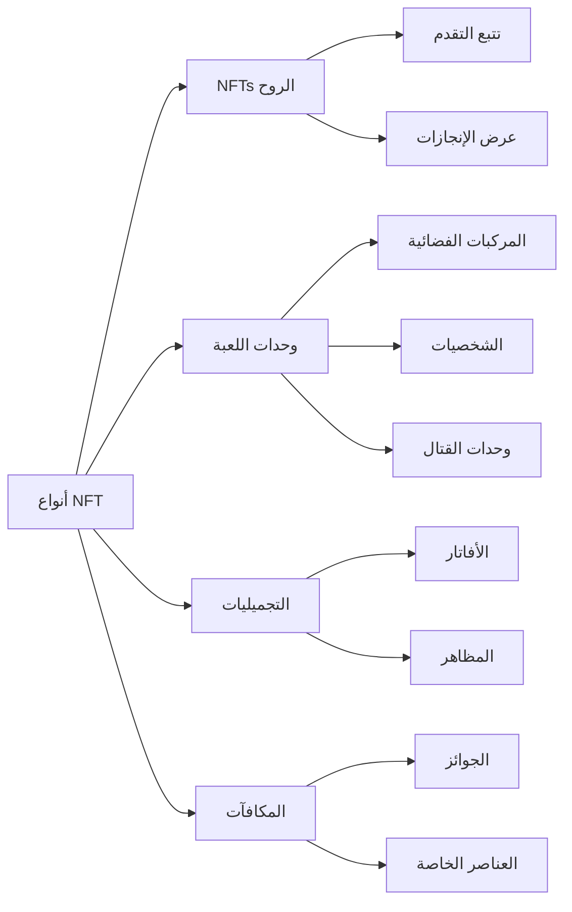
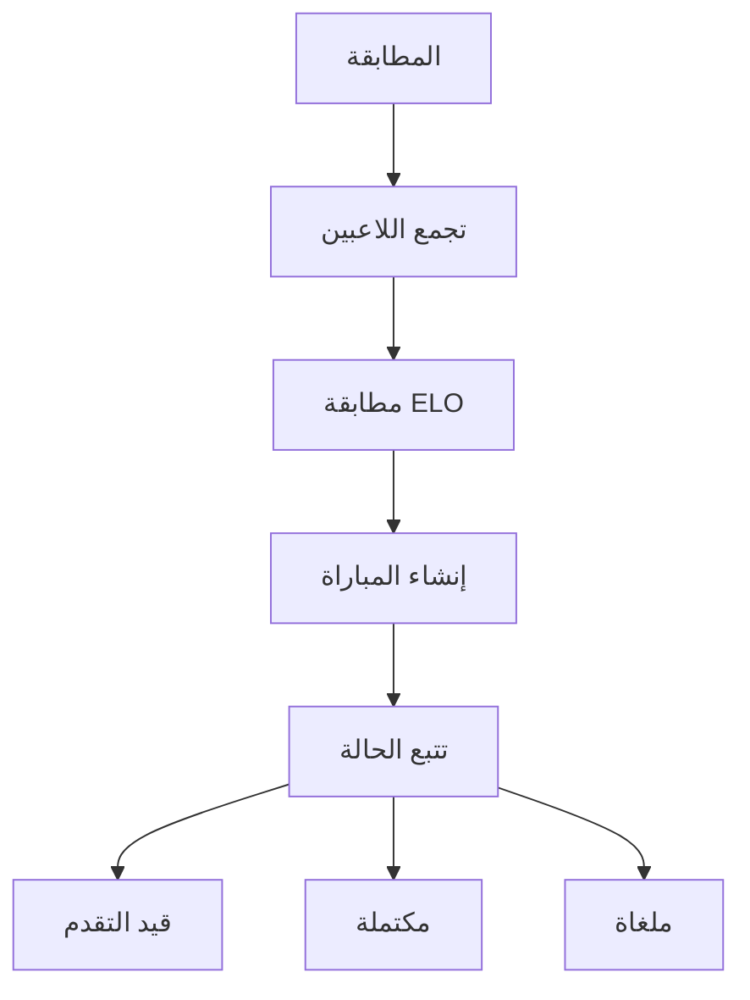

# الميزات الأساسية

## نظرة عامة

في جوهرها، تنفذ **Cosmicrafts DAO** كانستر موحد يتعامل مع جميع وظائف اللعبة الأساسية من خلال عدة أنظمة متكاملة. تضمن بنيتنا التفاعل السلس بين المكونات المختلفة مع الحفاظ على أمان وشفافية تقنية البلوكتشين.

---

## نظام اللاعبين

يشكل نظام اللاعبين العمود الفقري لتفاعل المستخدم داخل Cosmicrafts، حيث يدير كل شيء من الملفات الشخصية الأساسية إلى التفاعلات الاجتماعية المعقدة.

### إدارة الملف الشخصي

| الميزة | الوصف | فائدة اللاعب |
|---------|-------------|----------------|
| إنشاء الملف الشخصي | معرفات فريدة مع أسماء مستخدمين وأفاتار قابلة للتخصيص | هوية شخصية في الميتافيرس |
| نظام المستويات | تقدم قائم على الخبرة مع مكافآت | مسار تقدم واضح |
| تتبع الإحصائيات | مقاييس أداء شاملة | رؤى الأداء |
| نظام الألقاب | ألقاب قابلة للفتح تظهر الإنجازات | الاعتراف بالمكانة |

### الميزات الاجتماعية

يمكن للاعبين بناء شبكتهم من خلال:
- طلبات الصداقة وإدارتها
- التحكم في إعدادات الخصوصية
- إشعارات في الوقت الفعلي
- إدارة المستخدمين المحظورين
- تتبع النشاط الاجتماعي

## نظام الأصول

يستفيد نظام الأصول لدينا من معيار ICRC-7 لتوفير ملكية وقابلية للتشغيل المتبادل حقيقية.

### فئات NFT

## النظام الاقتصادي

يخلق اقتصادنا ثنائي التوكن نظاماً بيئياً متوازناً للاعبين المجانيين والمميزين.

### هيكل التوكن

| التوكن | الغرض | الحصول عليه | الاستخدام |
|-------|---------|-------------|--------|
| Spiral | الحوكمة والميزات المميزة | الشراء/التخزين | التصويت، الميزات المميزة |
| Stardust | عملة داخل اللعبة | مكافآت اللعب | الميزات الأساسية، التصنيع |

## نظام المطابقة

يضمن نظام المطابقة لدينا لعباً عادلاً وجذاباً من خلال مطابقة متطورة للاعبين.

### الميزات الرئيسية

- مطابقة ديناميكية قائمة على المهارة
- تحديثات الحالة في الوقت الفعلي
- تحقق تلقائي من المباراة
- تعديلات التصنيف القائمة على الأداء

## نظام المهام والإنجازات

نظام تقدم شامل يكافئ اللاعبين على إنجازاتهم.

### أنواع المهام

| النوع | التكرار | المكافآت | الغرض |
|------|-----------|---------|----------|
| يومي | 24 ساعة | مكافآت صغيرة | مشاركة منتظمة |
| أسبوعي | 7 أيام | مكافآت متوسطة | نشاط مستدام |
| خاص | حسب الحدث | مكافآت فريدة | فعاليات المجتمع |

### فئات الإنجازات
- إتقان القتال
- الإنجاز الاقتصادي
- المشاركة الاجتماعية
- إكمال المجموعات
- الأحداث الخاصة

## نظام التسجيل

نظام التسجيل الشفاف لدينا يتتبع جميع الأحداث والمعاملات المهمة.

### الأنشطة المتتبعة

| الفئة | الأحداث المتتبعة | الغرض |
|----------|---------------|----------|
| اللعب | المباريات، الإحصائيات | تحليل الأداء |
| الاقتصاد | المعاملات، التداولات | مراقبة الاقتصاد |
| الاجتماعي | التفاعلات، الأصدقاء | صحة المجتمع |
| التقدم | المستويات، الإنجازات | تطور اللاعب |

## الأمان والأداء

### تدابير الأمان
- ضوابط إدارية
- بروتوكولات أمان الترقية
- التحقق من المدخلات
- تحديد معدل الطلبات
- التحقق من المعاملات

### التحسينات
- كفاءة الكانستر الموحد
- استرجاع سريع للبيانات
- إدارة الذاكرة
- تحسين الاستعلامات

---

## الخاتمة
تمثل Cosmicrafts نموذجاً جديداً في ألعاب البلوكتشين مع الحفاظ على أعلى معايير الجودة والأمان والأداء.