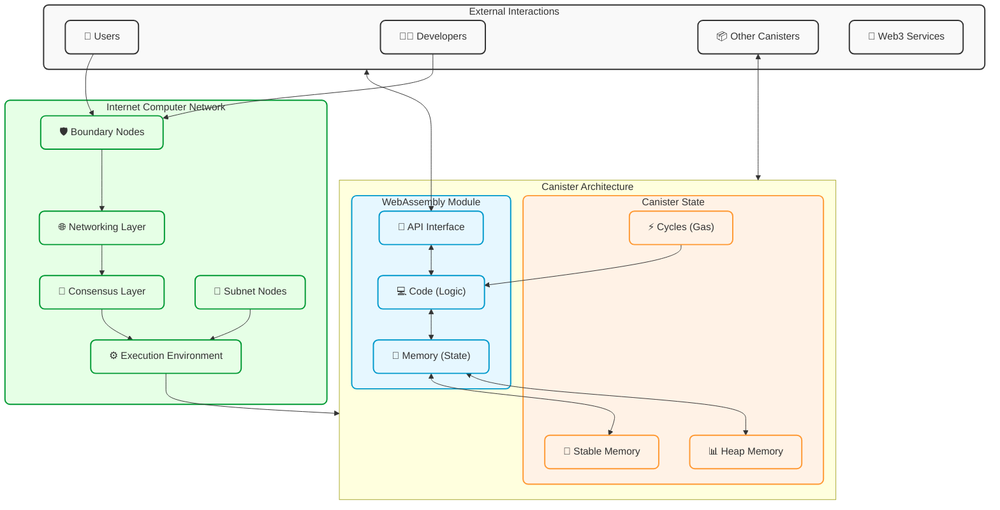
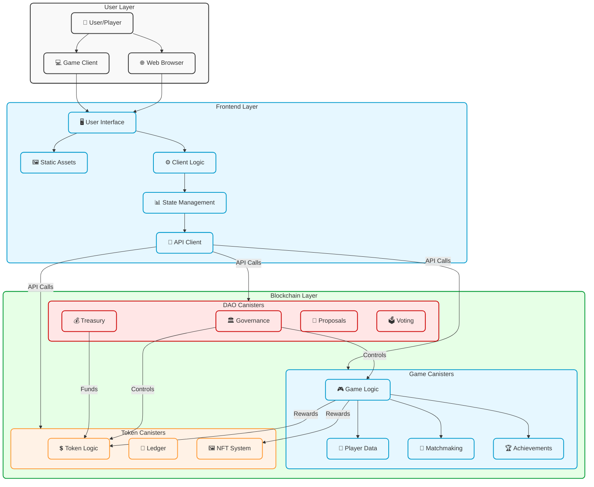
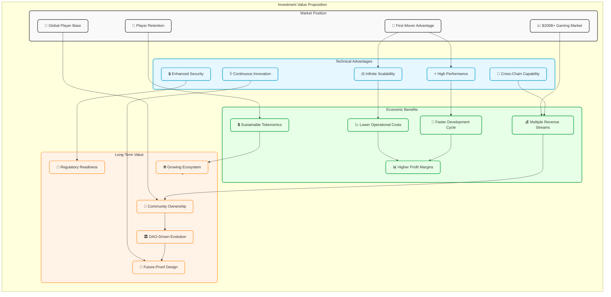

# Mermaid Diagram Examples

This document contains examples of enhanced mermaid diagrams that match the Cosmicrafts theme.

## Canister Architecture Diagram



## System Architecture Diagram



## Data Flow Sequence Diagram

```mermaid
sequenceDiagram
    participant User as 👤 User
    participant Frontend as 🖥️ Frontend
    participant API as 🔌 API Layer
    participant Validation as ✅ Validation
    participant GameState as 🎲 Game State
    participant Events as 📢 Events
    participant Other as 🔄 Other Systems
    
    User->>+Frontend: Initiates Action
    Frontend->>+API: API Request
    API->>+Validation: Validate Input
    
    alt Invalid Input
        Validation-->>-API: Reject Request
        API-->>-Frontend: Error Response
        Frontend-->>User: Display Error
    else Valid Input
        Validation->>+GameState: Process State Change
        GameState->>+Events: Emit Events
        Events->>Other: Notify Relevant Systems
        Events-->>-GameState: Confirmation
        GameState-->>-API: Return Updated State
        API-->>-Frontend: Success Response
        Frontend-->>-User: Update UI
    end
    
    Note over User,Other: All operations are recorded on-chain for transparency and auditability
```

## Security Layers Diagram

```mermaid
graph TD
    subgraph SecurityLayers["Security Architecture"]
        direction TB
        
        subgraph NetworkSecurity["Network Security"]
            L1["🔒 Boundary Node Protection"]
            L2["🛡️ DDoS Mitigation"]
            L3["🔐 TLS Encryption"]
        end
        
        subgraph CanisterSecurity["Canister Security"]
            L4["🧱 Canister Isolation"]
            L5["👮 Principal Authentication"]
            L6["🔑 Role-Based Access Control"]
        end
        
        subgraph ApplicationSecurity["Application Security"]
            L7["✅ Input Validation"]
            L8["🔍 Business Logic Verification"]
            L9["📝 Audit Logging"]
        end
        
        subgraph RecoverySecurity["Recovery & Resilience"]
            L10["⏱️ Rate Limiting"]
            L11["🔄 Automatic Recovery"]
            L12["🌐 Global Redundancy"]
        end
        
        NetworkSecurity --> CanisterSecurity
        CanisterSecurity --> ApplicationSecurity
        ApplicationSecurity --> RecoverySecurity
    end
    
    subgraph Threats["Threat Vectors"]
        T1["🔨 Brute Force Attacks"]
        T2["🕸️ Phishing Attempts"]
        T3["💉 Injection Attacks"]
        T4["🔄 Replay Attacks"]
        T5["💥 DoS Attacks"]
    end
    
    subgraph Mitigations["Mitigation Strategies"]
        M1["🔒 Cryptographic Verification"]
        M2["👁️ Anomaly Detection"]
        M3["🛡️ Circuit Breakers"]
        M4["📊 Behavioral Analysis"]
        M5["🔄 Self-Healing Systems"]
    end
    
    Threats --> NetworkSecurity
    SecurityLayers --> Mitigations
    
    classDef networkLayer fill:#ffe6e6,stroke:#cc0000,stroke-width:2px,rx:8px,ry:8px
    classDef canisterLayer fill:#fff2e6,stroke:#ff9933,stroke-width:2px,rx:8px,ry:8px
    classDef appLayer fill:#e6f7ff,stroke:#0099cc,stroke-width:2px,rx:8px,ry:8px
    classDef recoveryLayer fill:#e6ffe6,stroke:#009933,stroke-width:2px,rx:8px,ry:8px
    classDef threatLayer fill:#f9f9f9,stroke:#333333,stroke-width:2px,rx:8px,ry:8px
    classDef mitigationLayer fill:#f0f0ff,stroke:#6666cc,stroke-width:2px,rx:8px,ry:8px
    
    class NetworkSecurity,L1,L2,L3 networkLayer
    class CanisterSecurity,L4,L5,L6 canisterLayer
    class ApplicationSecurity,L7,L8,L9 appLayer
    class RecoverySecurity,L10,L11,L12 recoveryLayer
    class Threats,T1,T2,T3,T4,T5 threatLayer
    class Mitigations,M1,M2,M3,M4,M5 mitigationLayer
```



## Investment Value Proposition



## Future Roadmap

```mermaid
graph TD
    %% Core Platform
    subgraph CorePlatform["Core Platform"] 
        Cosmicrafts["🎮 Cosmicrafts Core"]
        GameEngine["⚙️ Game Engine"]
        TokenSystem["💰 Token Economy"]
        NFTSystem["🏆 NFT System"]
        DAOSystem["🏛️ DAO Governance"]
    end
    
    %% Future Integrations by Phase
    subgraph Phase1["Phase 1: Foundation (Current)"]
        CoreGameplay["🎲 Core Gameplay"]
        BasicEconomy["💵 Basic Economy"]
        CommunityBuilding["👥 Community Building"]
    end
    
    subgraph Phase2["Phase 2: Expansion (2024-2025)"]
        CrossChain["🔄 Cross-Chain Integration"]
        AI["🧠 On-Chain AI"]
        Analytics["📊 Advanced Analytics"]
        Metaverse["🌐 Metaverse Expansion"]
        Mobile["📱 Mobile Platform"]
    end
    
    subgraph Phase3["Phase 3: Ecosystem (2025-2026)"]
        ThirdPartyDev["👨‍💻 Third-Party Development"]
        UserGenContent["🎨 User-Generated Content"]
        AdvancedDAO["🏛️ Advanced DAO Features"]
        RealWorldAssets["🏢 Real-World Asset Integration"]
    end
    
    %% Ecosystem Partners
    subgraph Partners["Ecosystem Partners"]
        ORIGYN["💎 ORIGYN - RWA Protocol"]
        BOOMDAO["🚀 BOOM DAO - Game Infrastructure"]
        OpenChat["💬 OpenChat - Communication"]
        Dmail["📧 Dmail - Messaging"]
        Neutrinite["📈 Neutrinite - Data"]
        Bitfinity["⛓️ Bitfinity - Layer 2"]
        WaterNeuron["💧 WaterNeuron - Staking"]
    end
    
    %% Core Platform Relationships
    Cosmicrafts --> GameEngine & TokenSystem & NFTSystem & DAOSystem
    
    %% Phase Relationships
    Cosmicrafts --> CoreGameplay & BasicEconomy & CommunityBuilding
    
    Phase1 --> Phase2
    Phase2 --> Phase3
    
    %% Phase 2 Details
    GameEngine --> CrossChain & AI & Metaverse & Mobile
    TokenSystem --> CrossChain
    DAOSystem --> Analytics
    
    %% Phase 3 Details
    GameEngine --> ThirdPartyDev & UserGenContent
    DAOSystem --> AdvancedDAO
    NFTSystem --> RealWorldAssets
    
    %% Partner Integrations
    CrossChain --> Bitfinity
    AI --> Analytics
    TokenSystem --> WaterNeuron
    NFTSystem --> ORIGYN
    GameEngine --> BOOMDAO
    DAOSystem --> OpenChat & Dmail
    Analytics --> Neutrinite
    RealWorldAssets --> ORIGYN
    
    %% Styling
    classDef core fill:#e6f7ff,stroke:#0099cc,stroke-width:2px,rx:8px,ry:8px
    classDef phase1 fill:#ffe6e6,stroke:#cc0000,stroke-width:2px,rx:8px,ry:8px
    classDef phase2 fill:#e6ffe6,stroke:#009933,stroke-width:2px,rx:8px,ry:8px
    classDef phase3 fill:#f0f0ff,stroke:#6666cc,stroke-width:2px,rx:8px,ry:8px
    classDef partner fill:#fff2e6,stroke:#ff9933,stroke-width:2px,rx:8px,ry:8px
    
    class CorePlatform,Cosmicrafts,GameEngine,TokenSystem,NFTSystem,DAOSystem core
    class Phase1,CoreGameplay,BasicEconomy,CommunityBuilding phase1
    class Phase2,CrossChain,AI,Analytics,Metaverse,Mobile phase2
    class Phase3,ThirdPartyDev,UserGenContent,AdvancedDAO,RealWorldAssets phase3
    class Partners,ORIGYN,BOOMDAO,OpenChat,Dmail,Neutrinite,Bitfinity,WaterNeuron partner
``` 