# Architecture

## Overview

Cosmicrafts implements a hybrid architecture that strategically integrates  blockchain and WebSockets to deliver:

- Secure asset ownership and trading
- Fast, responsive gameplay
- Transparent governance
- Scalable infrastructure

## Core Technical Design

::: info Technical Implementation
The Motoko programming language enables our single-canister design through:
- Advanced memory management
- Efficient state representation
- Powerful type system
- Optimized asynchronous operations within a single canister

Our smart contracts are [open source on GitHub](https://github.com/cosmicrafts/cosmicrafts-dao) and [deployed publicly](https://dashboard.internetcomputer.org/canister/opcce-byaaa-aaaak-qcgda-cai) on the Internet Computer for full transparency.
:::

### Unified Canister Architecture

Cosmicrafts utilizes a single-canister architecture for core game logic, NFTs, and token operations, providing significant performance advantages:

| Traditional Multi-Canister | Cosmicrafts Single-Canister | Performance Impact |
|----------------------------|-----------------------------|--------------------|
| Cross-canister calls require consensus rounds | Internal function calls within same memory space | 3-10x faster operations |
| State changes across canisters need synchronization | Atomic state updates in a unified data model | Consistent data with no reconciliation |
| Multiple network round trips for complex operations | Single-hop execution for most game activities | Dramatically reduced latency |
| Serialization/deserialization overhead between canisters | Direct memory access to all system components | Lower computational overhead |

This architecture enables complex game operations like trading, crafting, and battling to execute immediately without the latency typically associated with blockchain applications. Players experience performance similar to traditional gaming platforms, while still benefiting from blockchain's security and ownership features.

```mermaid
graph TD
    %% Core User Layer
    User(("🧑 User"))
    
    %% Frontend Layer
    subgraph "Frontend Layer"
        UI["🖥️ User Interface"]
        Client["📱 Game Client"]
    end
    
    %% Communication Layer
    subgraph " "
        WS["📡 WebSocket Gateway"]
        API["🔌 API Interface"]
    end
    
    %% Blockchain Layer
    subgraph "Blockchain Layer"
        Canister["⚡ Game Canister"]
        DAO["SNS Governance"]
    end
    
    %% Connections
    User --> UI
    User --> Client
    UI --> WS
    UI --> API
    Client --> WS
    Client --> API
    WS --> Canister
    API --> Canister
    Canister -.->|"Reports to"| DAO
    DAO -->|"Controls"| Canister
    
    %% Styles
    classDef user fill:#1a2d40,stroke:#fff,stroke-width:2px
    classDef frontend fill:#0FB9FD20,stroke:#0FB9FD,stroke-width:2px
    classDef comms fill:#FFB80020,stroke:#FFB800,stroke-width:2px
    classDef blockchain fill:#00E5A420,stroke:#00E5A4,stroke-width:2px
    
    %% Apply styles
    class User user
    class UI,Client frontend
    class WS,API comms
    class Canister,DAO blockchain
```

## Real-Time Communication Layer

A critical component of our architecture is the real-time communication system required for multiplayer gameplay. We utilize:

### IC WebSocket Gateway
- **[IC WebSocket Gateway](https://github.com/omnia-network/ic-websocket-gateway)**: Provides WebSocket capabilities with ICP's cryptographic security
  - Enables real-time bidirectional communication
  - Maintains blockchain security guarantees
  - Supports multiple simultaneous connections

### Security Features
- **Message Signing**: All WebSocket messages are cryptographically signed
- **SSL/TLS Encryption**: Secure transport layer for all communications
- **Keep-alive Monitoring**: Automatic connection health checks

| Feature | Implementation | Benefit |
|---------|----------------|----------|
| Real-time Updates | WebSocket Protocol | Sub-second latency for game actions |
| Message Security | Cryptographic Signing | Tamper-proof communication |
| Connection Management | Automatic Reconnection | Seamless gameplay experience |
| State Synchronization | Sequence Numbers | Consistent game state across clients |
| Transport Security | SSL/TLS | Protected data transmission |

## Resource Management & Operations

### Gas-Free Environment

The Internet Computer eliminates the complexity of blockchain gas fees, returning to the simplicity of normal internet usage:

| Traditional Blockchain | Internet Computer |
|-----------------------|-------------------|
| Users pay gas fees for every transaction | Canister pays for its own computation with cycles |
| Complex fee system creates friction and barriers | Users experience Web2-like simplicity with no fees |

Unlike other blockchains where users must manage gas fees, the Internet Computer handles computation costs behind the scenes. This allows Cosmicrafts to deliver:

- **Mainstream Accessibility**: No cryptocurrency knowledge required to play
- **Micro-Transactions**: Even small in-game actions remain economically viable
- **Predictable Experience**: No surprising costs or failed transactions due to gas issues

### Operational Monitoring & Cycles Management

To maintain our gas-free environment and ensure optimal performance, Cosmicrafts employs industry-leading tools:

| Tool | Purpose | Implementation |
|------|---------|----------------|
| [Cycleops](https://cycleops.dev) | - Cycles management - Automated top-ups - Threshold alerts | Integrated with our deployment pipeline for proactive cycles management |
| [Canistergeek](https://github.com/usergeek/canistergeek-ic-motoko) | - Performance monitoring - Memory usage tracking - Log collection | Embedded in our Motoko codebase for real-time canister analytics |

## Dependencies & External Services

### Game Engine Dependencies
- **Current: Unity**
  - Industry-standard game development platform
  - WebGL export for browser-based gameplay
  - Cross-platform deployment capabilities
  - Integration with ICP.NET for blockchain features

- **Planned Migration: Bevy**
  - Open-source game engine written in Rust
  - Better performance characteristics
  - Full open-source technology stack
  - Native WebAssembly support
  - Aligns with our commitment to open-source development

### Frontend Dependencies
- **ICP Integration**: 
  - [ICP.NET](https://github.com/edjCase/ICP.NET) - .NET/C#/Unity library for native Internet Computer communication
  - Enables seamless blockchain integration in Unity games
  - Provides client generation for canister interfaces
  - Handles WebSocket connections and API interfaces

- **Web Framework**:
  - Vue.js with TypeScript
  - Vite for build tooling
  - PWA capabilities
  - Internationalization support via vue-i18n
  - Markdown rendering with advanced features

### Backend Dependencies
- **Motoko Package Manager**:
  - [MOPS](https://mops.one/) - Official package manager for Motoko
  - Manages Motoko dependencies and versioning

### Infrastructure Services
- **Internet Computer Protocol**:
  - Core blockchain infrastructure
  - Provides decentralized compute and storage
  - Handles consensus and node operations
  - Manages canister lifecycle

- **IC WebSocket Gateway**:
  - [Real-time communication infrastructure](https://github.com/omnia-network/ic-websocket-gateway)
  - Enables multiplayer gameplay features
  - Provides secure WebSocket connections
  - Integrates with ICP's security model

## Security Review Status

While a comprehensive security audit is planned for the future, we are currently:

- Building user base and maturing canister functionality
- Planning for professional audit once sufficient scale is reached
- Following security best practices and internal review processes

> For a comprehensive understanding of how these features are implemented, continue reading our [Core Features](/core-features) documentation.