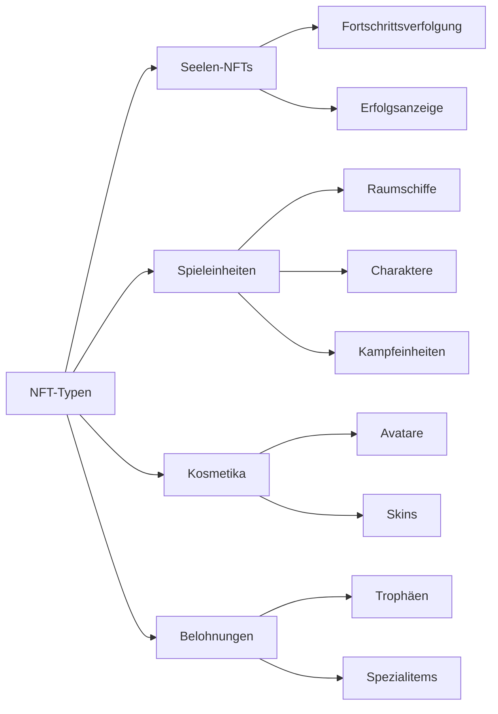
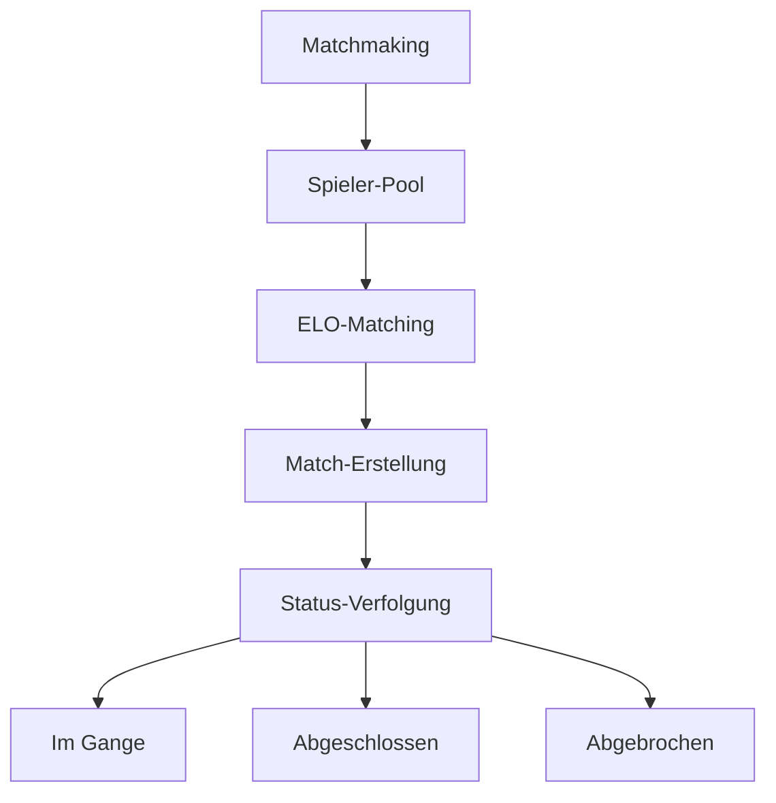

# Kernfunktionen

## Überblick

Im Kern implementiert die **Cosmicrafts DAO** einen einheitlichen Canister, der alle Kernfunktionalitäten des Spiels über mehrere integrierte Systeme verwaltet. Unsere Architektur gewährleistet eine nahtlose Interaktion zwischen verschiedenen Komponenten bei gleichzeitiger Wahrung der Sicherheit und Transparenz der Blockchain-Technologie.

---

## Spielersystem

Das Spielersystem bildet das Rückgrat der Benutzerinteraktion innerhalb von Cosmicrafts und verwaltet alles von grundlegenden Profilen bis hin zu komplexen sozialen Interaktionen.

### Profilverwaltung

| Funktion | Beschreibung | Spielervorteil |
|----------|--------------|----------------|
| Profilerstellung | Einzigartige IDs mit anpassbaren Benutzernamen und Avataren | Persönliche Identität im Metaversum |
| Levelsystem | Erfahrungsbasierte Progression mit Belohnungen | Klarer Fortschrittspfad |
| Statistikverfolgung | Umfassende Leistungsmetriken | Leistungseinblicke |
| Titelsystem | Freischaltbare Titel zur Anzeige von Errungenschaften | Statusanerkennung |

### Soziale Funktionen

Spieler können ihr Netzwerk aufbauen durch:
- Freundschaftsanfragen und -verwaltung
- Datenschutzeinstellungen-Kontrolle
- Echtzeit-Benachrichtigungen
- Verwaltung blockierter Benutzer
- Verfolgung sozialer Aktivitäten

## Asset-System

Unser Asset-System nutzt den ICRC-7-Standard, um echtes Eigentum und Interoperabilität zu gewährleisten.

### NFT-Kategorien

## Wirtschaftssystem

Unsere Dual-Token-Wirtschaft schafft ein ausgewogenes Ökosystem für sowohl Free-to-Play- als auch Premium-Spieler.

### Token-Struktur

| Token | Zweck | Erwerb | Verwendung |
|-------|--------|----------|------------|
| Spiral | Governance & Premium | Kauf/Staking | Abstimmung, Premium-Funktionen |
| Stardust | In-Game-Währung | Gameplay-Belohnungen | Basisfunktionen, Crafting |

## Matchmaking-System

Unser Matchmaking-System gewährleistet faires und spannendes Gameplay durch ausgeklügeltes Spieler-Matching.

### Hauptmerkmale

- Dynamisches, fähigkeitsbasiertes Matching
- Echtzeit-Statusaktualisierungen
- Automatische Match-Validierung
- Leistungsbasierte Bewertungsanpassungen

## Missions- und Erfolgssystem

Ein umfassendes Progressionssystem, das Spieler für ihre Leistungen belohnt.

### Missionstypen

| Typ | Häufigkeit | Belohnungen | Zweck |
|-----|------------|-------------|--------|
| Täglich | 24 Stunden | Kleine Belohnungen | Regelmäßiges Engagement |
| Wöchentlich | 7 Tage | Mittlere Belohnungen | Nachhaltige Aktivität |
| Spezial | Ereignisbasiert | Einzigartige Belohnungen | Community-Events |

### Erfolgskategorien
- Kampfmeisterschaft
- Wirtschaftliche Errungenschaft
- Soziales Engagement
- Sammlungsvervollständigung
- Spezialevents

## Protokollierungssystem

Unser transparentes Protokollierungssystem verfolgt alle wichtigen Ereignisse und Transaktionen.

### Verfolgte Aktivitäten

| Kategorie | Verfolgte Ereignisse | Zweck |
|-----------|---------------------|--------|
| Gameplay | Matches, Statistiken | Leistungsanalyse |
| Wirtschaft | Transaktionen, Handel | Wirtschaftsüberwachung |
| Sozial | Interaktionen, Freunde | Community-Gesundheit |
| Fortschritt | Level, Erfolge | Spielerentwicklung |

## Sicherheit und Leistung

### Sicherheitsmaßnahmen
- Administrative Kontrollen
- Upgrade-Sicherheitsprotokolle
- Eingabevalidierung
- Ratenbegrenzung
- Transaktionsverifizierung

### Optimierungen
- Single-Canister-Effizienz
- Schneller Datenabruf
- Speicherverwaltung
- Abfrageoptimierung

---

## Fazit
Cosmicrafts repräsentiert ein neues Paradigma im Blockchain-Gaming und hält dabei die höchsten Standards für Qualität, Sicherheit und Leistung aufrecht.