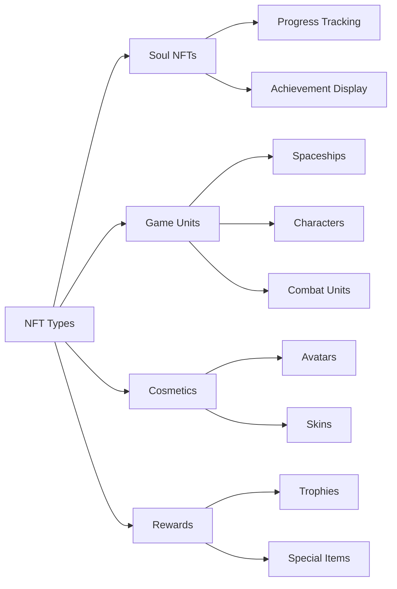
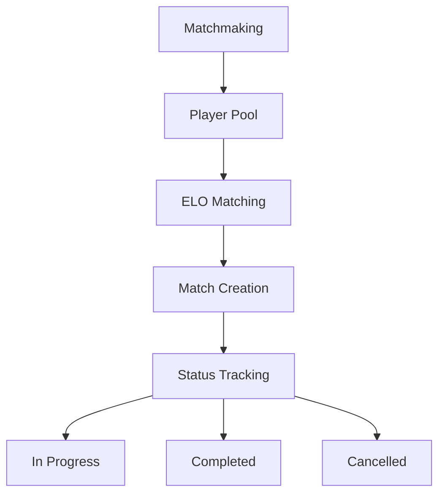

# Core Features

## Overview

At its core, **Cosmicrafts DAO** implements a unified canister that handles all core game functionality through several integrated systems. Our architecture ensures seamless interaction between different components while maintaining the security and transparency of blockchain technology.

---

## Player System

The Player System forms the backbone of user interaction within Cosmicrafts, managing everything from basic profiles to complex social interactions.

### Profile Management

| Feature | Description | Player Benefit |
|---------|-------------|----------------|
| Profile Creation | Unique IDs with customizable usernames and avatars | Personal identity in the metaverse |
| Level System | Experience-based progression with rewards | Clear progression path |
| Stats Tracking | Comprehensive performance metrics | Performance insights |
| Title System | Unlockable titles showing achievements | Status recognition |

### Social Features

Players can build their network through:
- Friend requests and management
- Privacy settings control
- Real-time notifications
- Blocked user management
- Social activity tracking

## Asset System

Our asset system leverages the ICRC-7 standard to provide true ownership and interoperability.

### NFT Categories

## Economy System

Our dual-token economy creates a balanced ecosystem for both free-to-play and premium players.

### Token Structure

| Token | Purpose | Acquisition | Usage |
|-------|---------|-------------|--------|
| Spiral | Governance & Premium | Purchase/Staking | Voting, Premium Features |
| Stardust | In-game Currency | Gameplay Rewards | Basic Features, Crafting |

## Matchmaking System

Our matchmaking system ensures fair and engaging gameplay through sophisticated player matching.

### Key Features

- Dynamic skill-based matching
- Real-time status updates
- Automatic match validation
- Performance-based rating adjustments

## Mission & Achievement System

A comprehensive progression system that rewards players for their accomplishments.

### Mission Types

| Type | Frequency | Rewards | Purpose |
|------|-----------|---------|----------|
| Daily | 24 hours | Small rewards | Regular engagement |
| Weekly | 7 days | Medium rewards | Sustained activity |
| Special | Event-based | Unique rewards | Community events |

### Achievement Categories
- Combat Mastery
- Economic Achievement
- Social Engagement
- Collection Completion
- Special Events

## Logging System

Our transparent logging system tracks all important events and transactions.

### Tracked Activities

| Category | Events Tracked | Purpose |
|----------|---------------|----------|
| Gameplay | Matches, Stats | Performance Analysis |
| Economy | Transactions, Trades | Economic Monitoring |
| Social | Interactions, Friends | Community Health |
| Progress | Levels, Achievements | Player Development |

## Security & Performance

### Security Measures
- Administrative controls
- Upgrade safety protocols
- Input validation
- Rate limiting
- Transaction verification

### Optimizations
- Single-canister efficiency
- Fast data retrieval
- Memory management
- Query optimization

---

## Conclusion
Cosmicrafts represents a new paradigm in blockchain gaming maintaining the highest standards of quality, security and performance.