# Arquitectura

## Visión General

Cosmicrafts implementa una arquitectura híbrida que integra estratégicamente blockchain y WebSockets para ofrecer:

- Propiedad y comercio seguro de activos
- Jugabilidad rápida y receptiva
- Gobernanza transparente
- Infraestructura escalable

## Diseño Técnico Principal

::: info Implementación Técnica
El lenguaje de programación Motoko permite nuestro diseño de canister único a través de:
- Gestión avanzada de memoria
- Representación eficiente del estado
- Sistema de tipos potente
- Operaciones asíncronas optimizadas dentro de un único canister

Nuestros contratos inteligentes son [código abierto en GitHub](https://github.com/cosmicrafts/cosmicrafts-dao) y están [desplegados públicamente](https://dashboard.internetcomputer.org/canister/opcce-byaaa-aaaak-qcgda-cai) en Internet Computer para total transparencia.
:::

### Arquitectura Unificada de Canister

Cosmicrafts utiliza una arquitectura de canister único para la lógica central del juego, NFTs y operaciones de tokens, proporcionando ventajas significativas de rendimiento:

| Multi-Canister Tradicional | Canister Único de Cosmicrafts | Impacto en Rendimiento |
|----------------------------|------------------------------|----------------------|
| Las llamadas entre canisters requieren rondas de consenso | Llamadas a funciones internas dentro del mismo espacio de memoria | Operaciones 3-10x más rápidas |
| Los cambios de estado entre canisters necesitan sincronización | Actualizaciones atómicas de estado en un modelo de datos unificado | Datos consistentes sin necesidad de reconciliación |
| Múltiples viajes de red para operaciones complejas | Ejecución en un solo salto para la mayoría de las actividades del juego | Latencia dramáticamente reducida |
| Sobrecarga de serialización/deserialización entre canisters | Acceso directo a memoria para todos los componentes del sistema | Menor sobrecarga computacional |

Esta arquitectura permite que operaciones complejas del juego como comerciar, craftear y combatir se ejecuten inmediatamente sin la latencia típicamente asociada con aplicaciones blockchain. Los jugadores experimentan un rendimiento similar a las plataformas de juego tradicionales, mientras mantienen los beneficios de seguridad y propiedad de blockchain.

```mermaid
graph TD
    %% Capa de Usuario
    User(("🧑 Usuario"))
    
    %% Capa Frontend
    subgraph "Capa Frontend"
        UI["🖥️ Interfaz de Usuario"]
        Client["📱 Cliente del Juego"]
    end
    
    %% Capa de Comunicación
    subgraph " "
        WS["📡 Gateway WebSocket"]
        API["🔌 Interfaz API"]
    end
    
    %% Capa Blockchain
    subgraph "Capa Blockchain"
        Canister["⚡ Canister del Juego"]
        DAO["Gobernanza SNS"]
    end
    
    %% Conexiones
    User --> UI
    User --> Client
    UI --> WS
    UI --> API
    Client --> WS
    Client --> API
    WS --> Canister
    API --> Canister
    Canister -.->|"Reporta a"| DAO
    DAO -->|"Controla"| Canister
    
    %% Estilos
    classDef user fill:#1a2d40,stroke:#fff,stroke-width:2px
    classDef frontend fill:#0FB9FD20,stroke:#0FB9FD,stroke-width:2px
    classDef comms fill:#FFB80020,stroke:#FFB800,stroke-width:2px
    classDef blockchain fill:#00E5A420,stroke:#00E5A4,stroke-width:2px
    
    %% Aplicar estilos
    class User user
    class UI,Client frontend
    class WS,API comms
    class Canister,DAO blockchain
```

## Capa de Comunicación en Tiempo Real

Un componente crítico de nuestra arquitectura es el sistema de comunicación en tiempo real requerido para el juego multijugador. Utilizamos:

### Gateway WebSocket de IC
- **[IC WebSocket Gateway](https://github.com/omnia-network/ic-websocket-gateway)**: Proporciona capacidades WebSocket con la seguridad criptográfica de ICP
  - Permite comunicación bidireccional en tiempo real
  - Mantiene garantías de seguridad blockchain
  - Soporta múltiples conexiones simultáneas

### Características de Seguridad
- **Firma de Mensajes**: Todos los mensajes WebSocket están firmados criptográficamente
- **Encriptación SSL/TLS**: Capa de transporte segura para todas las comunicaciones
- **Monitoreo Keep-alive**: Verificaciones automáticas de salud de conexión

| Característica | Implementación | Beneficio |
|----------------|----------------|-----------|
| Actualizaciones en Tiempo Real | Protocolo WebSocket | Latencia sub-segundo para acciones del juego |
| Seguridad de Mensajes | Firma Criptográfica | Comunicación a prueba de manipulaciones |
| Gestión de Conexiones | Reconexión Automática | Experiencia de juego fluida |
| Sincronización de Estado | Números de Secuencia | Estado de juego consistente entre clientes |
| Seguridad de Transporte | SSL/TLS | Transmisión de datos protegida |

## Gestión de Recursos y Operaciones

### Entorno Sin Gas

Internet Computer elimina la complejidad de las tarifas de gas blockchain, volviendo a la simplicidad del uso normal de internet:

| Blockchain Tradicional | Internet Computer |
|-----------------------|-------------------|
| Los usuarios pagan gas por cada transacción | El canister paga su propia computación con cycles |
| Sistema complejo de tarifas crea fricción y barreras | Los usuarios experimentan simplicidad tipo Web2 sin tarifas |

A diferencia de otras blockchains donde los usuarios deben gestionar tarifas de gas, Internet Computer maneja los costos de computación entre bastidores. Esto permite que Cosmicrafts ofrezca:

- **Accesibilidad Mainstream**: No se requiere conocimiento de criptomonedas para jugar
- **Micro-Transacciones**: Incluso pequeñas acciones en el juego siguen siendo económicamente viables
- **Experiencia Predecible**: Sin costos sorpresa ni transacciones fallidas por problemas de gas

### Monitoreo Operacional y Gestión de Cycles

Para mantener nuestro entorno sin gas y asegurar un rendimiento óptimo, Cosmicrafts emplea herramientas líderes en la industria:

| Herramienta | Propósito | Implementación |
|-------------|-----------|----------------|
| [Cycleops](https://cycleops.dev) | - Gestión de cycles - Recargas automatizadas - Alertas de umbral | Integrado con nuestro pipeline de despliegue para gestión proactiva de cycles |
| [Canistergeek](https://github.com/usergeek/canistergeek-ic-motoko) | - Monitoreo de rendimiento - Seguimiento de uso de memoria - Recolección de logs | Integrado en nuestro código Motoko para analíticas de canister en tiempo real |

## Dependencias y Servicios Externos

### Dependencias del Motor de Juego
- **Actual: Unity**
  - Plataforma estándar de la industria para desarrollo de juegos
  - Exportación WebGL para juego basado en navegador
  - Capacidades de despliegue multiplataforma
  - Integración con ICP.NET para características blockchain

- **Migración Planeada: Bevy**
  - Motor de juego de código abierto escrito en Rust
  - Mejores características de rendimiento
  - Stack tecnológico completamente open-source
  - Soporte nativo de WebAssembly
  - Alineado con nuestro compromiso con el desarrollo open-source

### Dependencias Frontend
- **Integración ICP**: 
  - [ICP.NET](https://github.com/edjCase/ICP.NET) - Biblioteca .NET/C#/Unity para comunicación nativa con Internet Computer
  - Permite integración fluida de blockchain en juegos Unity
  - Proporciona generación de cliente para interfaces de canister
  - Maneja conexiones WebSocket e interfaces API

- **Framework Web**:
  - Vue.js con TypeScript
  - Vite para herramientas de build
  - Capacidades PWA
  - Soporte de internacionalización via vue-i18n
  - Renderizado de Markdown con características avanzadas

### Dependencias Backend
- **Gestor de Paquetes Motoko**:
  - [MOPS](https://mops.one/) - Gestor de paquetes oficial para Motoko
  - Gestiona dependencias y versionado de Motoko

### Servicios de Infraestructura
- **Protocolo Internet Computer**:
  - Infraestructura blockchain central
  - Proporciona computación y almacenamiento descentralizado
  - Maneja operaciones de consenso y nodos
  - Gestiona ciclo de vida del canister

- **IC WebSocket Gateway**:
  - [Infraestructura de comunicación en tiempo real](https://github.com/omnia-network/ic-websocket-gateway)
  - Habilita características de juego multijugador
  - Proporciona conexiones WebSocket seguras
  - Se integra con el modelo de seguridad de ICP

## Estado de Revisión de Seguridad

Mientras que una auditoría de seguridad completa está planeada para el futuro, actualmente estamos:

- Construyendo base de usuarios y madurando funcionalidad del canister
- Planeando auditoría profesional una vez se alcance escala suficiente
- Siguiendo mejores prácticas de seguridad y procesos de revisión interna

> Para una comprensión completa de cómo se implementan estas características, continúa leyendo nuestra documentación de [Características Principales](/core-features).