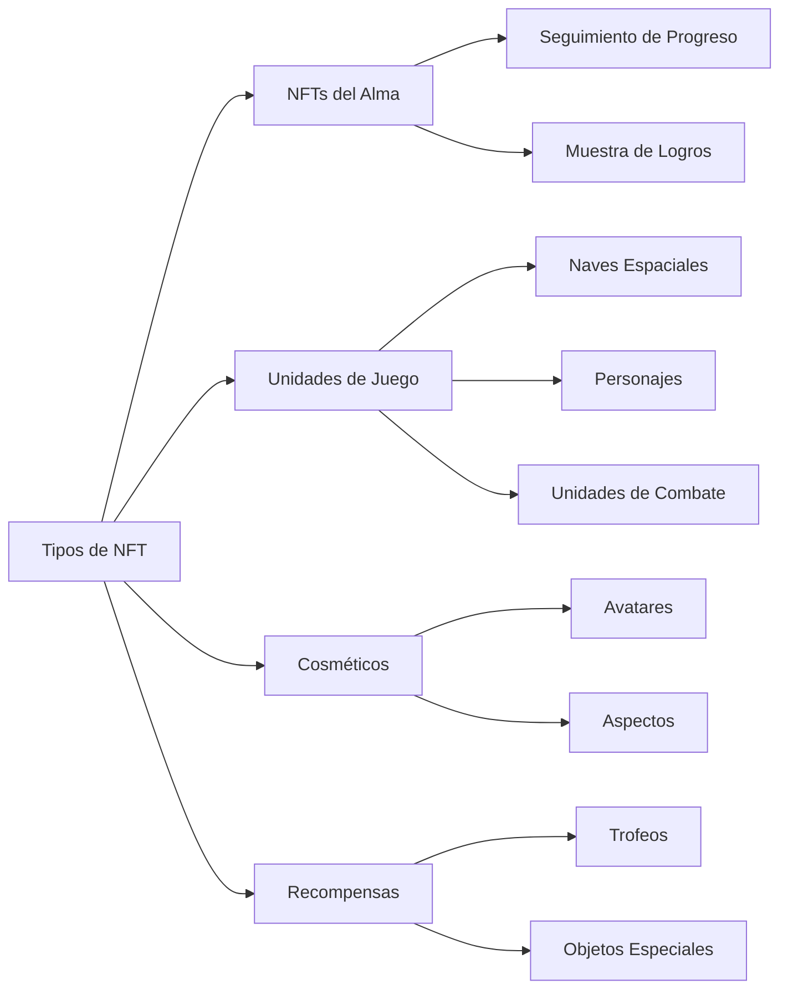
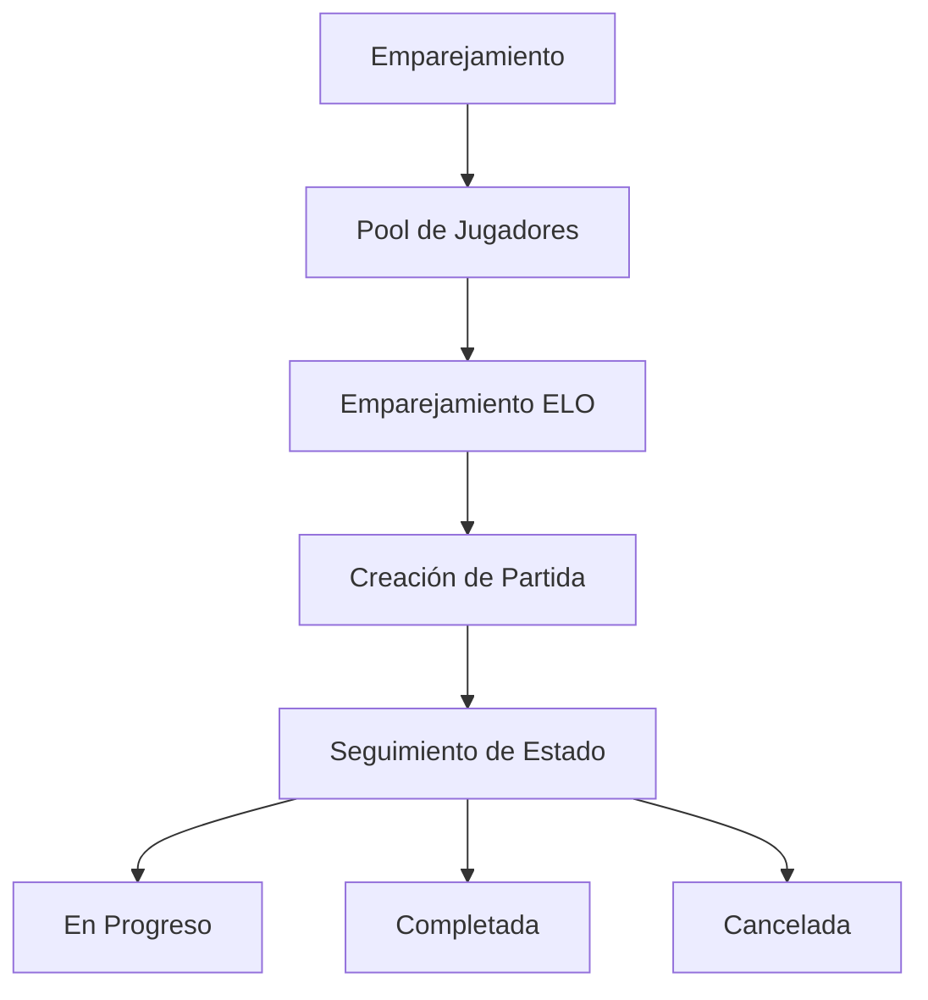

# Características Principales

## Visión General

En su núcleo, **Cosmicrafts DAO** implementa un canister unificado que maneja toda la funcionalidad central del juego a través de varios sistemas integrados. Nuestra arquitectura asegura una interacción fluida entre diferentes componentes mientras mantiene la seguridad y transparencia de la tecnología blockchain.

---

## Sistema de Jugadores

El Sistema de Jugadores forma la columna vertebral de la interacción del usuario dentro de Cosmicrafts, gestionando todo desde perfiles básicos hasta interacciones sociales complejas.

### Gestión de Perfiles

| Característica | Descripción | Beneficio para el Jugador |
|----------------|-------------|---------------------------|
| Creación de Perfil | IDs únicos con nombres de usuario y avatares personalizables | Identidad personal en el metaverso |
| Sistema de Niveles | Progresión basada en experiencia con recompensas | Ruta clara de progresión |
| Seguimiento de Estadísticas | Métricas completas de rendimiento | Información sobre rendimiento |
| Sistema de Títulos | Títulos desbloqueables que muestran logros | Reconocimiento de estatus |

### Características Sociales

Los jugadores pueden construir su red a través de:
- Solicitudes y gestión de amigos
- Control de configuración de privacidad
- Notificaciones en tiempo real
- Gestión de usuarios bloqueados
- Seguimiento de actividad social

## Sistema de Activos

Nuestro sistema de activos aprovecha el estándar ICRC-7 para proporcionar verdadera propiedad e interoperabilidad.

### Categorías de NFTs

## Sistema Económico

Nuestra economía de doble token crea un ecosistema equilibrado tanto para jugadores gratuitos como premium.

### Estructura de Tokens

| Token | Propósito | Adquisición | Uso |
|-------|-----------|-------------|-----|
| Spiral | Gobernanza y Premium | Compra/Staking | Votación, Características Premium |
| Stardust | Moneda del Juego | Recompensas de Juego | Características Básicas, Crafteo |

## Sistema de Emparejamiento

Nuestro sistema de emparejamiento asegura un juego justo y atractivo a través de un sofisticado emparejamiento de jugadores.

### Características Principales

- Emparejamiento dinámico basado en habilidad
- Actualizaciones de estado en tiempo real
- Validación automática de partidas
- Ajustes de clasificación basados en rendimiento

## Sistema de Misiones y Logros

Un sistema integral de progresión que recompensa a los jugadores por sus logros.

### Tipos de Misiones

| Tipo | Frecuencia | Recompensas | Propósito |
|------|------------|-------------|-----------|
| Diarias | 24 horas | Recompensas pequeñas | Participación regular |
| Semanales | 7 días | Recompensas medianas | Actividad sostenida |
| Especiales | Basado en eventos | Recompensas únicas | Eventos comunitarios |

### Categorías de Logros
- Maestría de Combate
- Logro Económico
- Participación Social
- Completar Colección
- Eventos Especiales

## Sistema de Registro

Nuestro sistema transparente de registro rastrea todos los eventos y transacciones importantes.

### Actividades Rastreadas

| Categoría | Eventos Rastreados | Propósito |
|-----------|-------------------|-----------|
| Jugabilidad | Partidas, Estadísticas | Análisis de Rendimiento |
| Economía | Transacciones, Intercambios | Monitoreo Económico |
| Social | Interacciones, Amigos | Salud de la Comunidad |
| Progreso | Niveles, Logros | Desarrollo del Jugador |

## Seguridad y Rendimiento

### Medidas de Seguridad
- Controles administrativos
- Protocolos de seguridad en actualizaciones
- Validación de entrada
- Limitación de tasa
- Verificación de transacciones

### Optimizaciones
- Eficiencia de canister único
- Recuperación rápida de datos
- Gestión de memoria
- Optimización de consultas

---

## Conclusión
Cosmicrafts representa un nuevo paradigma en juegos blockchain manteniendo los más altos estándares de calidad, seguridad y rendimiento.