# Architecture

## Vue d'Ensemble

Cosmicrafts implémente une architecture hybride qui intègre stratégiquement blockchain et WebSockets pour offrir :

- Propriété et commerce sécurisés des actifs
- Gameplay rapide et réactif
- Gouvernance transparente
- Infrastructure évolutive

## Conception Technique Principale

::: info Implémentation Technique
Le langage de programmation Motoko permet notre conception de canister unique grâce à :
- Gestion avancée de la mémoire
- Représentation efficace de l'état
- Système de types puissant
- Opérations asynchrones optimisées au sein d'un canister unique

Nos contrats intelligents sont [open source sur GitHub](https://github.com/cosmicrafts/cosmicrafts-dao) et [déployés publiquement](https://dashboard.internetcomputer.org/canister/opcce-byaaa-aaaak-qcgda-cai) sur Internet Computer pour une transparence totale.
:::

### Architecture Unifiée du Canister

Cosmicrafts utilise une architecture de canister unique pour la logique de jeu centrale, les NFTs et les opérations de tokens, offrant des avantages significatifs en termes de performance :

| Multi-Canister Traditionnel | Canister Unique de Cosmicrafts | Impact sur la Performance |
|----------------------------|------------------------------|------------------------|
| Les appels inter-canisters nécessitent des rounds de consensus | Appels de fonctions internes dans le même espace mémoire | Opérations 3-10x plus rapides |
| Les changements d'état entre canisters nécessitent une synchronisation | Mises à jour atomiques de l'état dans un modèle de données unifié | Données cohérentes sans réconciliation |
| Multiples allers-retours réseau pour les opérations complexes | Exécution en un seul saut pour la plupart des activités de jeu | Latence considérablement réduite |
| Surcharge de sérialisation/désérialisation entre canisters | Accès direct à la mémoire pour tous les composants du système | Surcharge computationnelle réduite |

Cette architecture permet aux opérations complexes du jeu comme le trading, le crafting et les combats de s'exécuter immédiatement sans la latence typiquement associée aux applications blockchain. Les joueurs bénéficient d'une performance similaire aux plateformes de jeu traditionnelles, tout en conservant les avantages de sécurité et de propriété de la blockchain.

```mermaid
graph TD
    %% Couche Utilisateur
    User(("🧑 Utilisateur"))
    
    %% Couche Frontend
    subgraph "Couche Frontend"
        UI["🖥️ Interface Utilisateur"]
        Client["📱 Client de Jeu"]
    end
    
    %% Couche Communication
    subgraph " "
        WS["📡 Passerelle WebSocket"]
        API["🔌 Interface API"]
    end
    
    %% Couche Blockchain
    subgraph "Couche Blockchain"
        Canister["⚡ Canister de Jeu"]
        DAO["Gouvernance SNS"]
    end
    
    %% Connexions
    User --> UI
    User --> Client
    UI --> WS
    UI --> API
    Client --> WS
    Client --> API
    WS --> Canister
    API --> Canister
    Canister -.->|"Rapporte à"| DAO
    DAO -->|"Contrôle"| Canister
    
    %% Styles
    classDef user fill:#1a2d40,stroke:#fff,stroke-width:2px
    classDef frontend fill:#0FB9FD20,stroke:#0FB9FD,stroke-width:2px
    classDef comms fill:#FFB80020,stroke:#FFB800,stroke-width:2px
    classDef blockchain fill:#00E5A420,stroke:#00E5A4,stroke-width:2px
    
    %% Appliquer les styles
    class User user
    class UI,Client frontend
    class WS,API comms
    class Canister,DAO blockchain
```

## Couche de Communication en Temps Réel

Un composant critique de notre architecture est le système de communication en temps réel requis pour le gameplay multijoueur. Nous utilisons :

### Passerelle WebSocket IC
- **[IC WebSocket Gateway](https://github.com/omnia-network/ic-websocket-gateway)** : Fournit des capacités WebSocket avec la sécurité cryptographique d'ICP
  - Permet une communication bidirectionnelle en temps réel
  - Maintient les garanties de sécurité blockchain
  - Supporte de multiples connexions simultanées

### Fonctionnalités de Sécurité
- **Signature des Messages** : Tous les messages WebSocket sont signés cryptographiquement
- **Chiffrement SSL/TLS** : Couche de transport sécurisée pour toutes les communications
- **Surveillance Keep-alive** : Vérifications automatiques de l'état des connexions

| Fonctionnalité | Implémentation | Bénéfice |
|----------------|----------------|-----------|
| Mises à Jour en Temps Réel | Protocole WebSocket | Latence sub-seconde pour les actions de jeu |
| Sécurité des Messages | Signature Cryptographique | Communication inviolable |
| Gestion des Connexions | Reconnexion Automatique | Expérience de jeu fluide |
| Synchronisation d'État | Numéros de Séquence | État de jeu cohérent entre clients |
| Sécurité du Transport | SSL/TLS | Transmission de données protégée |

## Gestion des Ressources et Opérations

### Environnement Sans Gas

Internet Computer élimine la complexité des frais de gas blockchain, revenant à la simplicité d'utilisation normale d'internet :

| Blockchain Traditionnelle | Internet Computer |
|--------------------------|-------------------|
| Les utilisateurs paient des frais de gas pour chaque transaction | Le canister paie sa propre computation avec des cycles |
| Le système complexe de frais crée des frictions et des barrières | Les utilisateurs bénéficient d'une simplicité type Web2 sans frais |

Contrairement aux autres blockchains où les utilisateurs doivent gérer les frais de gas, Internet Computer gère les coûts de computation en arrière-plan. Cela permet à Cosmicrafts d'offrir :

- **Accessibilité Grand Public** : Aucune connaissance en cryptomonnaies requise pour jouer
- **Micro-Transactions** : Même les petites actions en jeu restent économiquement viables
- **Expérience Prévisible** : Pas de coûts surprises ni de transactions échouées à cause du gas

### Surveillance Opérationnelle et Gestion des Cycles

Pour maintenir notre environnement sans gas et assurer une performance optimale, Cosmicrafts emploie des outils leaders de l'industrie :

| Outil | Objectif | Implémentation |
|-------|----------|----------------|
| [Cycleops](https://cycleops.dev) | - Gestion des cycles - Recharges automatisées - Alertes de seuil | Intégré à notre pipeline de déploiement pour une gestion proactive des cycles |
| [Canistergeek](https://github.com/usergeek/canistergeek-ic-motoko) | - Surveillance des performances - Suivi de l'utilisation mémoire - Collecte des logs | Intégré dans notre code Motoko pour des analyses en temps réel du canister |

## Dépendances et Services Externes

### Dépendances du Moteur de Jeu
- **Actuel : Unity**
  - Plateforme standard de l'industrie pour le développement de jeux
  - Export WebGL pour le jeu basé sur navigateur
  - Capacités de déploiement multiplateforme
  - Intégration avec ICP.NET pour les fonctionnalités blockchain

- **Migration Prévue : Bevy**
  - Moteur de jeu open source écrit en Rust
  - Meilleures caractéristiques de performance
  - Stack technologique entièrement open source
  - Support natif de WebAssembly
  - Aligné avec notre engagement envers le développement open source

### Dépendances Frontend
- **Intégration ICP** : 
  - [ICP.NET](https://github.com/edjCase/ICP.NET) - Bibliothèque .NET/C#/Unity pour la communication native avec Internet Computer
  - Permet une intégration fluide de la blockchain dans les jeux Unity
  - Fournit la génération de client pour les interfaces canister
  - Gère les connexions WebSocket et les interfaces API

- **Framework Web** :
  - Vue.js avec TypeScript
  - Vite pour les outils de build
  - Capacités PWA
  - Support de l'internationalisation via vue-i18n
  - Rendu Markdown avec fonctionnalités avancées

### Dépendances Backend
- **Gestionnaire de Paquets Motoko** :
  - [MOPS](https://mops.one/) - Gestionnaire de paquets officiel pour Motoko
  - Gère les dépendances et le versionnage Motoko

### Services d'Infrastructure
- **Protocole Internet Computer** :
  - Infrastructure blockchain centrale
  - Fournit le calcul et le stockage décentralisés
  - Gère les opérations de consensus et de nœuds
  - Gère le cycle de vie du canister

- **Passerelle WebSocket IC** :
  - [Infrastructure de communication en temps réel](https://github.com/omnia-network/ic-websocket-gateway)
  - Active les fonctionnalités de jeu multijoueur
  - Fournit des connexions WebSocket sécurisées
  - S'intègre avec le modèle de sécurité ICP

## État de la Revue de Sécurité

Bien qu'un audit de sécurité complet soit prévu pour l'avenir, nous sommes actuellement :

- En train de construire la base d'utilisateurs et de faire mûrir la fonctionnalité du canister
- En train de planifier un audit professionnel une fois une échelle suffisante atteinte
- En suivant les meilleures pratiques de sécurité et les processus de revue interne

> Pour une compréhension complète de la façon dont ces fonctionnalités sont implémentées, continuez la lecture de notre documentation sur les [Fonctionnalités Principales](/core-features).