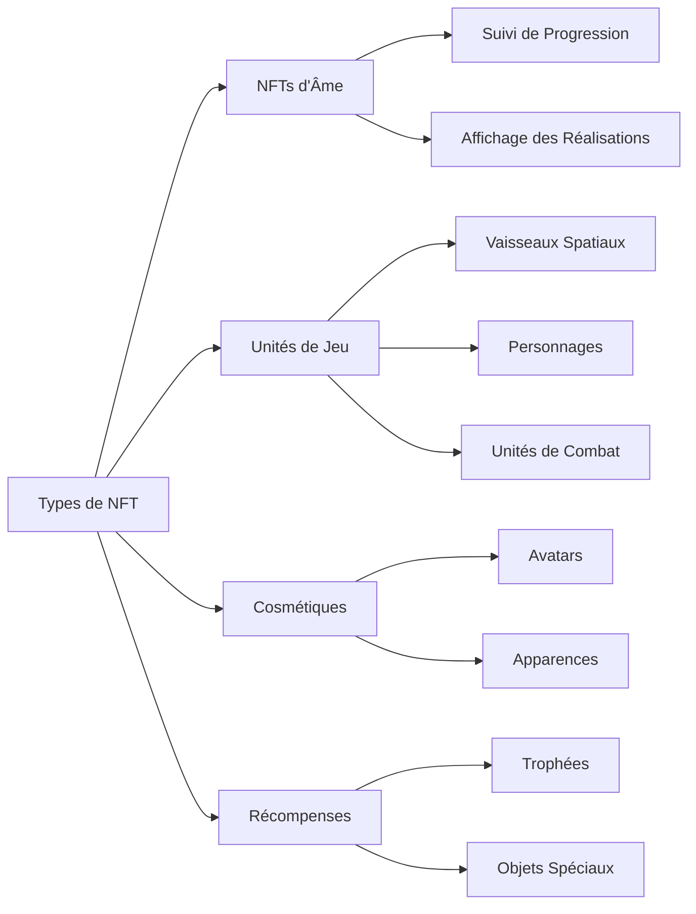
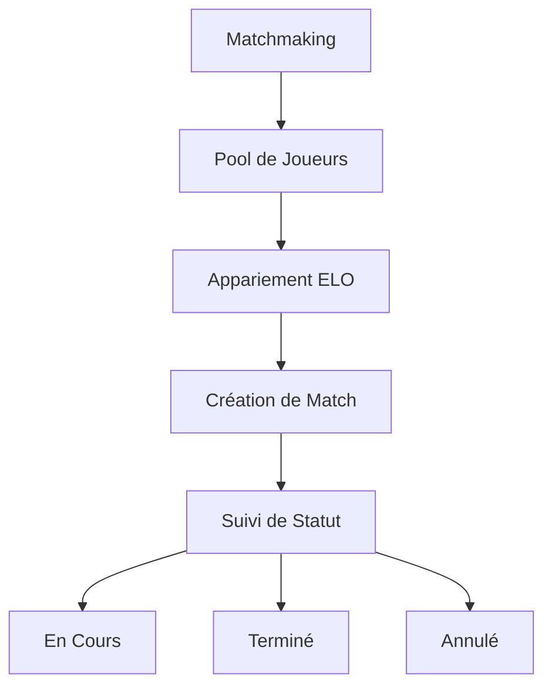

# Fonctionnalités Principales

## Vue d'Ensemble

À sa base, **Cosmicrafts DAO** implémente un canister unifié qui gère toutes les fonctionnalités principales du jeu à travers plusieurs systèmes intégrés. Notre architecture assure une interaction fluide entre les différents composants tout en maintenant la sécurité et la transparence de la technologie blockchain.

---

## Système de Joueurs

Le Système de Joueurs forme l'épine dorsale de l'interaction utilisateur au sein de Cosmicrafts, gérant tout, des profils de base aux interactions sociales complexes.

### Gestion des Profils

| Fonctionnalité | Description | Bénéfice pour le Joueur |
|----------------|-------------|------------------------|
| Création de Profil | IDs uniques avec noms d'utilisateur et avatars personnalisables | Identité personnelle dans le métavers |
| Système de Niveaux | Progression basée sur l'expérience avec récompenses | Chemin de progression clair |
| Suivi des Statistiques | Métriques de performance complètes | Aperçus de performance |
| Système de Titres | Titres débloquables montrant les réalisations | Reconnaissance du statut |

### Fonctionnalités Sociales

Les joueurs peuvent construire leur réseau via :
- Demandes et gestion d'amis
- Contrôle des paramètres de confidentialité
- Notifications en temps réel
- Gestion des utilisateurs bloqués
- Suivi de l'activité sociale

## Système d'Actifs

Notre système d'actifs exploite le standard ICRC-7 pour fournir une véritable propriété et interopérabilité.

### Catégories de NFTs

## Système Économique

Notre économie à double token crée un écosystème équilibré pour les joueurs gratuits et premium.

### Structure des Tokens

| Token | Objectif | Acquisition | Utilisation |
|-------|----------|-------------|-------------|
| Spiral | Gouvernance & Premium | Achat/Staking | Vote, Fonctionnalités Premium |
| Stardust | Monnaie In-game | Récompenses de Jeu | Fonctionnalités de Base, Crafting |

## Système de Matchmaking

Notre système de matchmaking assure un gameplay équitable et engageant grâce à un appariement sophistiqué des joueurs.

### Caractéristiques Principales

- Appariement dynamique basé sur les compétences
- Mises à jour de statut en temps réel
- Validation automatique des matchs
- Ajustements de classement basés sur la performance

## Système de Missions et Réalisations

Un système de progression complet qui récompense les joueurs pour leurs accomplissements.

### Types de Missions

| Type | Fréquence | Récompenses | Objectif |
|------|-----------|-------------|----------|
| Quotidiennes | 24 heures | Petites récompenses | Engagement régulier |
| Hebdomadaires | 7 jours | Récompenses moyennes | Activité soutenue |
| Spéciales | Basé sur les événements | Récompenses uniques | Événements communautaires |

### Catégories de Réalisations
- Maîtrise du Combat
- Réalisation Économique
- Engagement Social
- Complétion de Collection
- Événements Spéciaux

## Système de Journalisation

Notre système de journalisation transparent suit tous les événements et transactions importants.

### Activités Suivies

| Catégorie | Événements Suivis | Objectif |
|-----------|------------------|-----------|
| Gameplay | Matchs, Statistiques | Analyse de Performance |
| Économie | Transactions, Échanges | Surveillance Économique |
| Social | Interactions, Amis | Santé de la Communauté |
| Progression | Niveaux, Réalisations | Développement du Joueur |

## Sécurité et Performance

### Mesures de Sécurité
- Contrôles administratifs
- Protocoles de sécurité des mises à jour
- Validation des entrées
- Limitation des taux
- Vérification des transactions

### Optimisations
- Efficacité du canister unique
- Récupération rapide des données
- Gestion de la mémoire
- Optimisation des requêtes

---

## Conclusion
Cosmicrafts représente un nouveau paradigme dans le gaming blockchain en maintenant les plus hauts standards de qualité, sécurité et performance.