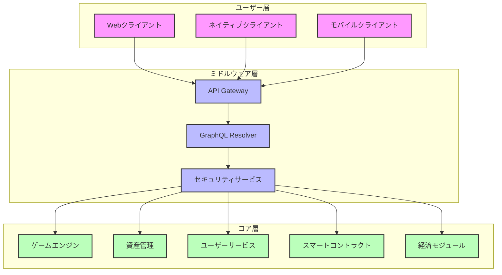

# アーキテクチャ

## 概要

Cosmicraftsは、Internet Computer Protocol（ICP）のスケーラビリティとセキュリティを活用しながら、必要に応じて他のブロックチェーンと統合するハイブリッドアーキテクチャを採用しています。このアプローチにより、ハイパフォーマンス、低レイテンシー、および低トランザクションコストが確保されます。

::: info サマリー
このセクションでは、Cosmicraftsプラットフォームのコア技術コンポーネント、それらの相互作用方法、およびシステム全体のアーキテクチャを形成する技術的意思決定について概説します。
:::

## 技術的堅牢性

| コンポーネント | 主な技術 | 利点 |
|-------------|-----------|---------|
| **バックエンド** | Rust, Motoko | 高性能、型安全、堅牢性 |
| **スマートコントラクト** | ICP Canisters | スケーラブルな処理、オンチェーン検証 |
| **クライアント** | Unity, WASM | クロスプラットフォーム、高パフォーマンス |
| **ストレージ** | オンチェーン、IPFS | 永続性、分散化、耐検閲性 |
| **API層** | GraphQL, REST | 柔軟なデータアクセス、効率的なクエリ |
| **インフラストラクチャ** | ICP、分散型ノード | 高可用性、耐障害性 |

## ハイブリッドデザイン

Cosmicraftsのアーキテクチャは3つの主要なコンポーネントで構成されています：

### 1. コア層

プラットフォームの中心的な機能を提供します：

- **スマートコントラクト** - ICP canistersで実装され、所有権、取引、ゲームの状態を管理
- **ゲームエンジン** - ゲームプレイのメカニクス、物理、およびインタラクションを処理
- **経済モジュール** - トークン供給、資産価値、およびインフレコントロールを管理
- **ユーザーサービス** - アカウント、認証、およびプロファイル管理を扱う
- **資産管理** - NFTの作成、交換、および進化を可能にする

### 2. ミドルウェア層

クライアントとコア機能を接続します：

- **API Gateway** - すべての受信リクエストを制御し適切なサービスにルーティング
- **GraphQL Resolver** - 効率的なデータアクセスとマニピュレーションを可能にする
- **セキュリティサービス** - リクエストの認証と承認を確保

### 3. ユーザー層

クライアントサイドのインターフェースを提供します：

## 概要

Cosmicraftsは、ブロックチェーンとWebSocketを戦略的に統合したハイブリッドアーキテクチャを実装し、以下を実現します：

- 安全な資産所有権と取引
- 高速でレスポンシブなゲームプレイ
- 透明性のあるガバナンス
- スケーラブルなインフラストラクチャ

## コア技術設計

::: info 技術実装
Motokプログラミング言語は、以下を通じて単一キャニスター設計を可能にします：
- 高度なメモリ管理
- 効率的な状態表現
- 強力な型システム
- 単一キャニスター内での最適化された非同期操作

私たちのスマートコントラクトは、完全な透明性のために[GitHubでオープンソース](https://github.com/cosmicrafts/cosmicrafts-dao)として提供され、[Internet Computer上で公開](https://dashboard.internetcomputer.org/canister/opcce-byaaa-aaaak-qcgda-cai)されています。
:::

### 統合キャニスターアーキテクチャ

Cosmicraftsは、コアゲームロジック、NFT、トークン操作のために単一キャニスターアーキテクチャを活用し、大きなパフォーマンス上の利点を提供します：

| 従来のマルチキャニスター | Cosmicrafts単一キャニスター | パフォーマンスへの影響 |
|----------------------------|-----------------------------|--------------------|
| クロスキャニスター呼び出しにコンセンサスラウンドが必要 | 同一メモリ空間内での内部関数呼び出し | 3-10倍高速な操作 |
| キャニスター間の状態変更に同期が必要 | 統合データモデルでのアトミックな状態更新 | 調整不要の一貫したデータ |
| 複雑な操作に複数のネットワークラウンドトリップが必要 | ほとんどのゲーム活動に単一ホップ実行 | 大幅に削減された遅延 |
| キャニスター間のシリアライズ/デシリアライズのオーバーヘッド | すべてのシステムコンポーネントへの直接メモリアクセス | 低い計算オーバーヘッド |

このアーキテクチャにより、取引、クラフティング、バトルなどの複雑なゲーム操作を、ブロックチェーンアプリケーションで一般的な遅延なしに即座に実行できます。プレイヤーは、ブロックチェーンのセキュリティと所有権機能の利点を享受しながら、従来のゲームプラットフォームと同様のパフォーマンスを体験できます。

```mermaid
graph TD
    %% Core User Layer
    User(("🧑 ユーザー"))
    
    %% Frontend Layer
    subgraph "フロントエンドレイヤー"
        UI["🖥️ ユーザーインターフェース"]
        Client["📱 ゲームクライアント"]
    end
    
    %% Communication Layer
    subgraph " "
        WS["📡 WebSocketゲートウェイ"]
        API["🔌 APIインターフェース"]
    end
    
    %% Blockchain Layer
    subgraph "ブロックチェーンレイヤー"
        Canister["⚡ ゲームキャニスター"]
        DAO["SNSガバナンス"]
    end
    
    %% Connections
    User --> UI
    User --> Client
    UI --> WS
    UI --> API
    Client --> WS
    Client --> API
    WS --> Canister
    API --> Canister
    Canister -.->|"報告"| DAO
    DAO -->|"制御"| Canister
    
    %% Styles
    classDef user fill:#1a2d40,stroke:#fff,stroke-width:2px
    classDef frontend fill:#0FB9FD20,stroke:#0FB9FD,stroke-width:2px
    classDef comms fill:#FFB80020,stroke:#FFB800,stroke-width:2px
    classDef blockchain fill:#00E5A420,stroke:#00E5A4,stroke-width:2px
    
    %% Apply styles
    class User user
    class UI,Client frontend
    class WS,API comms
    class Canister,DAO blockchain
```

## リアルタイム通信レイヤー

私たちのアーキテクチャの重要なコンポーネントは、マルチプレイヤーゲームプレイに必要なリアルタイム通信システムです。以下を活用します：

### IC WebSocketゲートウェイ
- **[IC WebSocket Gateway](https://github.com/omnia-network/ic-websocket-gateway)**: ICPの暗号化セキュリティとともにWebSocket機能を提供
  - リアルタイムの双方向通信が可能
  - ブロックチェーンのセキュリティ保証を維持
  - 複数の同時接続をサポート

### セキュリティ機能
- **メッセージ署名**: すべてのWebSocketメッセージは暗号化署名
- **SSL/TLS暗号化**: すべての通信に対するセキュアな転送レイヤー
- **キープアライブモニタリング**: 自動接続健全性チェック

| 機能 | 実装 | 利点 |
|---------|----------------|----------|
| リアルタイム更新 | WebSocketプロトコル | ゲームアクションに対する1秒未満の遅延 |
| メッセージセキュリティ | 暗号化署名 | 改ざん防止通信 |
| 接続管理 | 自動再接続 | シームレスなゲーム体験 |
| 状態同期 | シーケンス番号 | クライアント間の一貫したゲーム状態 |
| 転送セキュリティ | SSL/TLS | 保護されたデータ転送 |

## リソース管理 & オペレーション

### ガスフリー環境

Internet Computerは、ブロックチェーンのガス料金の複雑さを排除し、通常のインターネット使用の単純さに戻ります：

| 従来のブロックチェーン | Internet Computer |
|-----------------------|-------------------|
| ユーザーがすべてのトランザクションにガス料金を支払う | キャニスターがサイクルで自身の計算コストを支払う |
| 複雑な手数料システムが摩擦と障壁を生む | ユーザーは手数料なしでWeb2のような単純さを体験 |

ユーザーがガス料金を管理する必要がある他のブロックチェーンとは異なり、Internet Computerはバックグラウンドで計算コストを処理します。これによりCosmicraftsは以下を提供できます：

- **メインストリームアクセシビリティ**: ゲームプレイに暗号通貨の知識不要
- **マイクロトランザクション**: 小規模なゲーム内アクションも経済的に実行可能
- **予測可能な体験**: ガスの問題による予期せぬコストや失敗したトランザクションなし

### オペレーションモニタリング & サイクル管理

ガスフリー環境を維持し、最適なパフォーマンスを確保するため、Cosmicraftsは業界最高のツールを使用します：

| ツール | 目的 | 実装 |
|------|---------|----------------|
| [Cycleops](https://cycleops.dev) | - サイクル管理 - 自動トップアップ - しきい値アラート | 先制的なサイクル管理のためにデプロイメントパイプラインと統合 |
| [Canistergeek](https://github.com/usergeek/canistergeek-ic-motoko) | - パフォーマンスモニタリング - メモリ使用量追跡 - ログ収集 | リアルタイムキャニスター分析のためにMotokoコードベースに組み込み |

## 依存関係 & 外部サービス

### ゲームエンジン依存関係
- **現在: Unity**
  - 業界標準のゲーム開発プラットフォーム
  - ブラウザベースのゲームプレイ用WebGLエクスポート
  - クロスプラットフォームデプロイメント機能
  - ブロックチェーン機能用のICP.NET統合

- **計画中の移行: Bevy**
  - Rustで書かれたオープンソースゲームエンジン
  - より優れたパフォーマンス特性
  - 完全なオープンソース技術スタック
  - ネイティブWebAssemblyサポート
  - オープンソース開発への私たちのコミットメントと整合

### フロントエンド依存関係
- **ICP統合**: 
  - [ICP.NET](https://github.com/edjCase/ICP.NET) - Internet Computerネイティブ通信用の.NET/C#/Unityライブラリ
  - Unityゲームでのシームレスなブロックチェーン統合が可能
  - キャニスターインターフェース用のクライアント生成を提供
  - WebSocket接続とAPIインターフェースを処理

- **Webフレームワーク**:
  - TypeScript搭載のVue.js
  - ビルドツールとしてVite
  - PWA機能
  - vue-i18nによる国際化サポート
  - 高度な機能を備えたマークダウンレンダリング

### バックエンド依存関係
- **Motokoパッケージマネージャー**:
  - [MOPS](https://mops.one/) - Motoko公式パッケージマネージャー
  - Motoko依存関係とバージョニングを管理

### インフラストラクチャサービス
- **Internet Computer Protocol**:
  - コアブロックチェーンインフラストラクチャ
  - 分散コンピューティングとストレージを提供
  - コンセンサスとノード操作を処理
  - キャニスターライフサイクルを管理

- **IC WebSocket Gateway**:
  - [リアルタイム通信インフラストラクチャ](https://github.com/omnia-network/ic-websocket-gateway)
  - マルチプレイヤーゲームプレイ機能を可能に
  - セキュアなWebSocket接続を提供
  - ICPのセキュリティモデルと統合

## セキュリティレビューステータス

包括的なセキュリティ監査は将来的に計画されていますが、現在は：

- ユーザーベースを構築し、キャニスター機能を成熟させている
- 十分なスケールに達した時点でプロフェッショナル監査を計画
- セキュリティベストプラクティスと内部レビュープロセスに従っている

> これらの機能がどのように実装されているかの包括的な理解については、[コア機能](/core-features)のドキュメントを続けてお読みください。

