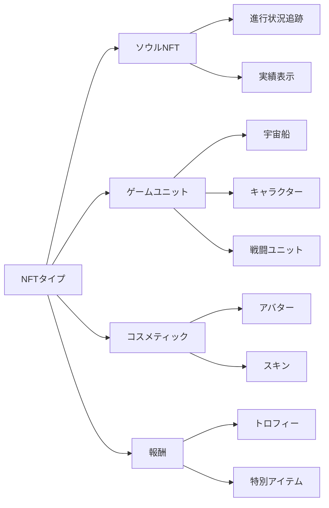
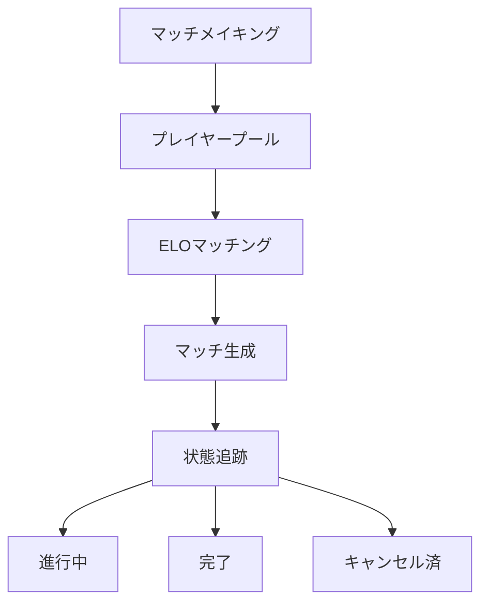

# コア機能

## 概要

Cosmicraftsは、統合キャニスターを通じてすべてのコアゲーム機能を管理します。私たちのアーキテクチャは、ブロックチェーン技術のセキュリティと透明性を維持しながら、以下を提供します：

::: info 技術仕様
このセクションでは、ゲームプレイと機能の概要を提供します。各システムの具体的な実装と技術的詳細については、システム設計文書をご参照ください。
:::

## プレイヤーシステム

プレイヤーシステムは、基本的なプロフィールから複雑なソーシャルインタラクションまで、Cosmicrafts内のユーザーインタラクションの中核を形成します。

### プロフィール管理

| 機能 | 説明 | プレイヤーメリット |
|---------|-------------|----------------|
| プロフィール作成 | カスタマイズ可能なユーザー名とアバターを持つ固有ID | メタバース内の個人アイデンティティ |
| レベルシステム | 報酬付きの経験値ベースの進行 | 明確な進行パス |
| 統計追跡 | 包括的なパフォーマンス指標 | パフォーマンスインサイト |
| 称号システム | アンロック可能な実績称号 | ステータス認識 |

### ソーシャル機能

プレイヤーは以下を通じてネットワークを構築できます：
- フレンドリクエストと管理
- プライバシー設定コントロール
- リアルタイム通知
- ブロックユーザー管理
- ソーシャル活動追跡

## アセットシステム

私たちのアセットシステムは、ICRC-7標準を活用して真の所有権と相互運用性を提供します。

### NFTカテゴリー

## 経済システム

私たちのデュアルトークン経済は、フリープレイヤーとプレミアムプレイヤーの両方にバランスの取れたエコシステムを提供します。

### トークン構造

| トークン | 目的 | 獲得方法 | 使用用途 |
|-------|---------|-------------|--------|
| Spiral | ガバナンス & プレミアム | 購入/ステーキング | 投票、プレミアム機能 |
| Stardust | ゲーム内通貨 | ゲームプレイ報酬 | 基本機能、クラフト |

## マッチメイキングシステム

私たちのマッチメイキングシステムは、洗練されたプレイヤーマッチングを通じて公平で魅力的なゲームプレイを保証します。

### 主要機能

- 動的スキルベースマッチング
- リアルタイム状態更新
- 自動マッチ検証
- パフォーマンスベースのレート調整

## ミッション & アチーブメントシステム

プレイヤーの達成を報酬付けする包括的な進行システムです。

### ミッションタイプ

| タイプ | サイクル | 報酬 | 目的 |
|------|-----------|---------|----------|
| デイリー | 24時間 | 小規模報酬 | 定期的な参加 |
| ウィークリー | 7日間 | 中規模報酬 | 継続的な活動 |
| スペシャル | イベントベース | ユニーク報酬 | コミュニティイベント |

### アチーブメントカテゴリー
- 戦闘熟練度
- 経済アチーブメント
- ソーシャル参加
- コレクション完成
- スペシャルイベント

## ロギングシステム

私たちの透明性のあるロギングシステムは、すべての重要なイベントと取引を追跡します。

### 追跡される活動

| カテゴリー | 追跡イベント | 目的 |
|----------|---------------|----------|
| ゲームプレイ | マッチ、統計 | パフォーマンス分析 |
| 経済 | 取引、交換 | 経済モニタリング |
| ソーシャル | インタラクション、フレンド | コミュニティ健全性 |
| 進行 | レベル、アチーブメント | プレイヤー発展 |

## セキュリティ & パフォーマンス

### セキュリティ対策
- 管理者コントロール
- アップグレード安全プロトコル
- 入力検証
- レート制限
- 取引検証

### 最適化
- 単一キャニスター効率性
- 高速データ取得
- メモリ管理
- クエリ最適化

---

## 結論
Cosmicraftsは、品質、セキュリティ、パフォーマンスの最高基準を維持するブロックチェーンゲームの新しいパラダイムを代表します。