# 아키텍처

## 개요

Cosmicrafts는 블록체인과 웹소켓을 전략적으로 통합하는 하이브리드 아키텍처를 구현하여 다음을 제공합니다:

- 안전한 자산 소유권과 거래
- 빠르고 반응성 높은 게임플레이
- 투명한 거버넌스
- 확장 가능한 인프라

## 핵심 기술 설계

::: info 기술 구현
Motoko 프로그래밍 언어는 다음을 통해 단일 캐니스터 설계를 가능하게 합니다:
- 고급 메모리 관리
- 효율적인 상태 표현
- 강력한 타입 시스템
- 단일 캐니스터 내 최적화된 비동기 작업

우리의 스마트 컨트랙트는 완전한 투명성을 위해 [GitHub에서 오픈 소스](https://github.com/cosmicrafts/cosmicrafts-dao)로 제공되며 [Internet Computer에 공개적으로 배포](https://dashboard.internetcomputer.org/canister/opcce-byaaa-aaaak-qcgda-cai)되어 있습니다.
:::

### 통합 캐니스터 아키텍처

Cosmicrafts는 핵심 게임 로직, NFT, 토큰 작업을 위해 단일 캐니스터 아키텍처를 활용하여 상당한 성능 이점을 제공합니다:

| 기존 다중 캐니스터 | Cosmicrafts 단일 캐니스터 | 성능 영향 |
|----------------------------|-----------------------------|--------------------|
| 크로스 캐니스터 호출에 합의 라운드 필요 | 동일 메모리 공간 내 내부 함수 호출 | 3-10배 빠른 작업 |
| 캐니스터 간 상태 변경에 동기화 필요 | 통합 데이터 모델에서 원자적 상태 업데이트 | 조정이 필요 없는 일관된 데이터 |
| 복잡한 작업에 여러 네트워크 왕복 필요 | 대부분의 게임 활동에 단일 홉 실행 | 크게 감소된 지연 시간 |
| 캐니스터 간 직렬화/역직렬화 오버헤드 | 모든 시스템 구성 요소에 직접 메모리 접근 | 낮은 계산 오버헤드 |

이 아키텍처를 통해 거래, 제작, 전투와 같은 복잡한 게임 작업을 블록체인 애플리케이션에서 일반적으로 발생하는 지연 없이 즉시 실행할 수 있습니다. 플레이어는 블록체인의 보안과 소유권 기능의 이점을 누리면서도 전통적인 게임 플랫폼과 유사한 성능을 경험할 수 있습니다.

```mermaid
graph TD
    %% Core User Layer
    User(("🧑 사용자"))
    
    %% Frontend Layer
    subgraph "프론트엔드 레이어"
        UI["🖥️ 사용자 인터페이스"]
        Client["📱 게임 클라이언트"]
    end
    
    %% Communication Layer
    subgraph " "
        WS["📡 웹소켓 게이트웨이"]
        API["🔌 API 인터페이스"]
    end
    
    %% Blockchain Layer
    subgraph "블록체인 레이어"
        Canister["⚡ 게임 캐니스터"]
        DAO["SNS 거버넌스"]
    end
    
    %% Connections
    User --> UI
    User --> Client
    UI --> WS
    UI --> API
    Client --> WS
    Client --> API
    WS --> Canister
    API --> Canister
    Canister -.->|"보고"| DAO
    DAO -->|"제어"| Canister
    
    %% Styles
    classDef user fill:#1a2d40,stroke:#fff,stroke-width:2px
    classDef frontend fill:#0FB9FD20,stroke:#0FB9FD,stroke-width:2px
    classDef comms fill:#FFB80020,stroke:#FFB800,stroke-width:2px
    classDef blockchain fill:#00E5A420,stroke:#00E5A4,stroke-width:2px
    
    %% Apply styles
    class User user
    class UI,Client frontend
    class WS,API comms
    class Canister,DAO blockchain
```

## 실시간 통신 레이어

우리 아키텍처의 중요한 구성 요소는 멀티플레이어 게임플레이에 필요한 실시간 통신 시스템입니다. 다음을 활용합니다:

### IC 웹소켓 게이트웨이
- **[IC WebSocket Gateway](https://github.com/omnia-network/ic-websocket-gateway)**: ICP의 암호화 보안과 함께 웹소켓 기능 제공
  - 실시간 양방향 통신 가능
  - 블록체인 보안 보장 유지
  - 다중 동시 연결 지원

### 보안 기능
- **메시지 서명**: 모든 웹소켓 메시지는 암호화 서명됨
- **SSL/TLS 암호화**: 모든 통신에 대한 보안 전송 계층
- **연결 상태 모니터링**: 자동 연결 상태 확인

| 기능 | 구현 | 이점 |
|---------|----------------|----------|
| 실시간 업데이트 | 웹소켓 프로토콜 | 게임 액션에 대한 1초 미만의 지연 시간 |
| 메시지 보안 | 암호화 서명 | 변조 방지 통신 |
| 연결 관리 | 자동 재연결 | 끊김 없는 게임 경험 |
| 상태 동기화 | 시퀀스 번호 | 클라이언트 간 일관된 게임 상태 |
| 전송 보안 | SSL/TLS | 보호된 데이터 전송 |

## 리소스 관리 & 운영

### 가스비 없는 환경

Internet Computer는 블록체인 가스비의 복잡성을 제거하고 일반적인 인터넷 사용의 단순성으로 돌아갑니다:

| 기존 블록체인 | Internet Computer |
|-----------------------|-------------------|
| 사용자가 모든 트랜잭션에 가스비 지불 | 캐니스터가 사이클로 자체 연산 비용 지불 |
| 복잡한 수수료 시스템이 마찰과 장벽 생성 | 사용자는 수수료 없이 Web2와 유사한 단순성 경험 |

사용자가 가스비를 관리해야 하는 다른 블록체인과 달리, Internet Computer는 연산 비용을 백그라운드에서 처리합니다. 이를 통해 Cosmicrafts는 다음을 제공할 수 있습니다:

- **주류 접근성**: 게임 플레이에 암호화폐 지식 불필요
- **마이크로 트랜잭션**: 작은 게임 내 액션도 경제적으로 실행 가능
- **예측 가능한 경험**: 가스 문제로 인한 예상치 못한 비용이나 실패한 트랜잭션 없음

### 운영 모니터링 & 사이클 관리

가스비 없는 환경을 유지하고 최적의 성능을 보장하기 위해 Cosmicrafts는 업계 최고의 도구를 사용합니다:

| 도구 | 목적 | 구현 |
|------|---------|----------------|
| [Cycleops](https://cycleops.dev) | - 사이클 관리 - 자동 충전 - 임계값 알림 | 선제적 사이클 관리를 위해 배포 파이프라인과 통합 |
| [Canistergeek](https://github.com/usergeek/canistergeek-ic-motoko) | - 성능 모니터링 - 메모리 사용량 추적 - 로그 수집 | 실시간 캐니스터 분석을 위해 Motoko 코드베이스에 내장 |

## 의존성 & 외부 서비스

### 게임 엔진 의존성
- **현재: Unity**
  - 업계 표준 게임 개발 플랫폼
  - 브라우저 기반 게임플레이를 위한 WebGL 내보내기
  - 크로스 플랫폼 배포 기능
  - 블록체인 기능을 위한 ICP.NET 통합

- **계획된 마이그레이션: Bevy**
  - Rust로 작성된 오픈 소스 게임 엔진
  - 더 나은 성능 특성
  - 완전한 오픈 소스 기술 스택
  - 네이티브 WebAssembly 지원
  - 오픈 소스 개발에 대한 우리의 약속과 일치

### 프론트엔드 의존성
- **ICP 통합**: 
  - [ICP.NET](https://github.com/edjCase/ICP.NET) - Internet Computer 네이티브 통신을 위한 .NET/C#/Unity 라이브러리
  - Unity 게임에서 원활한 블록체인 통합 가능
  - 캐니스터 인터페이스용 클라이언트 생성 제공
  - 웹소켓 연결 및 API 인터페이스 처리

- **웹 프레임워크**:
  - TypeScript가 있는 Vue.js
  - 빌드 도구로 Vite
  - PWA 기능
  - vue-i18n을 통한 국제화 지원
  - 고급 기능이 있는 마크다운 렌더링

### 백엔드 의존성
- **Motoko 패키지 관리자**:
  - [MOPS](https://mops.one/) - Motoko 공식 패키지 관리자
  - Motoko 의존성 및 버전 관리

### 인프라 서비스
- **Internet Computer Protocol**:
  - 핵심 블록체인 인프라
  - 분산 컴퓨팅 및 스토리지 제공
  - 합의 및 노드 작업 처리
  - 캐니스터 수명 주기 관리

- **IC WebSocket Gateway**:
  - [실시간 통신 인프라](https://github.com/omnia-network/ic-websocket-gateway)
  - 멀티플레이어 게임플레이 기능 지원
  - 보안 웹소켓 연결 제공
  - ICP의 보안 모델과 통합

## 보안 검토 상태

향후 종합적인 보안 감사가 계획되어 있는 동안, 현재 우리는:

- 사용자 기반을 구축하고 캐니스터 기능을 성숙시키는 중
- 충분한 규모에 도달하면 전문적인 감사 계획
- 보안 모범 사례와 내부 검토 프로세스 준수

> 이러한 기능이 어떻게 구현되는지 종합적으로 이해하려면 [핵심 기능](/core-features) 문서를 계속 읽어보세요.