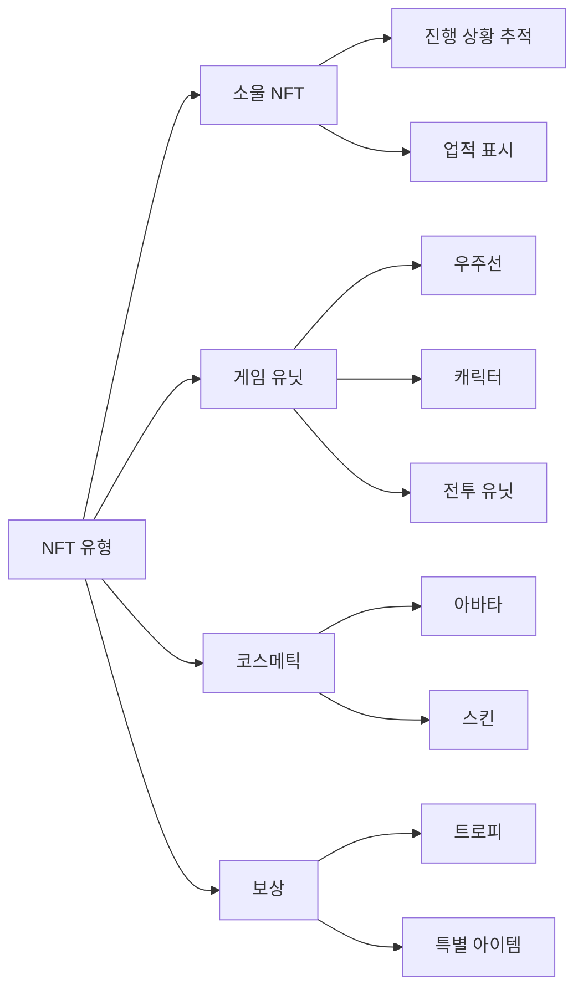
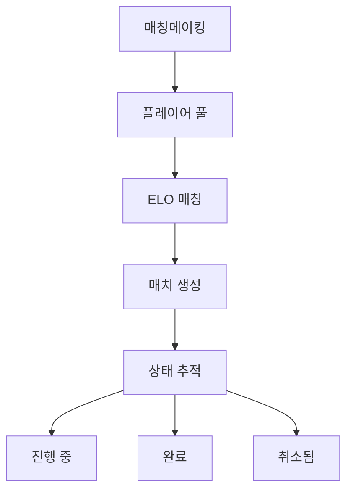

# 핵심 기능

## 개요

핵심적으로, **Cosmicrafts DAO**는 통합된 캐니스터를 통해 여러 통합 시스템을 통해 모든 핵심 게임 기능을 처리합니다. 우리의 아키텍처는 블록체인 기술의 보안성과 투명성을 유지하면서 다양한 구성 요소 간의 원활한 상호 작용을 보장합니다.

::: info 기술 사양
이 섹션에서는 게임플레이와 기능의 개요를 제공합니다. 각 시스템의 구체적인 구현과 기술적 세부사항은 시스템 설계 문서를 참조하세요.
:::

## 플레이어 시스템

플레이어 시스템은 기본 프로필부터 복잡한 소셜 상호 작용까지 Cosmicrafts 내의 사용자 상호 작용의 중추를 형성합니다.

### 프로필 관리

| 기능 | 설명 | 플레이어 혜택 |
|---------|-------------|----------------|
| 프로필 생성 | 사용자 지정 가능한 사용자 이름과 아바타가 있는 고유 ID | 메타버스에서의 개인 정체성 |
| 레벨 시스템 | 보상이 있는 경험 기반 진행 | 명확한 진행 경로 |
| 통계 추적 | 종합적인 성과 지표 | 성과 인사이트 |
| 칭호 시스템 | 업적을 보여주는 잠금 해제 가능한 칭호 | 상태 인정 |

### 소셜 기능

플레이어는 다음을 통해 네트워크를 구축할 수 있습니다:
- 친구 요청 및 관리
- 개인정보 설정 제어
- 실시간 알림
- 차단된 사용자 관리
- 소셜 활동 추적

## 자산 시스템

우리의 자산 시스템은 ICRC-7 표준을 활용하여 진정한 소유권과 상호 운용성을 제공합니다.

### NFT 카테고리

## 경제 시스템

우리의 이중 토큰 경제는 무료 플레이어와 프리미엄 플레이어 모두를 위한 균형 잡힌 생태계를 만듭니다.

### 토큰 구조

| 토큰 | 목적 | 획득 방법 | 사용 |
|-------|---------|-------------|--------|
| Spiral | 거버넌스 & 프리미엄 | 구매/스테이킹 | 투표, 프리미엄 기능 |
| Stardust | 게임 내 통화 | 게임플레이 보상 | 기본 기능, 제작 |

## 매칭 시스템

우리의 매칭 시스템은 정교한 플레이어 매칭을 통해 공정하고 매력적인 게임플레이를 보장합니다.

### 주요 기능

- 동적 실력 기반 매칭
- 실시간 상태 업데이트
- 자동 매치 검증
- 성과 기반 등급 조정

## 미션 & 업적 시스템

플레이어의 성취를 보상하는 포괄적인 진행 시스템입니다.

### 미션 유형

| 유형 | 주기 | 보상 | 목적 |
|------|-----------|---------|----------|
| 일일 | 24시간 | 소규모 보상 | 정기적 참여 |
| 주간 | 7일 | 중규모 보상 | 지속적 활동 |
| 특별 | 이벤트 기반 | 고유 보상 | 커뮤니티 이벤트 |

### 업적 카테고리
- 전투 숙련도
- 경제 업적
- 소셜 참여
- 컬렉션 완성
- 특별 이벤트

## 로깅 시스템

우리의 투명한 로깅 시스템은 모든 중요한 이벤트와 거래를 추적합니다.

### 추적된 활동

| 카테고리 | 추적된 이벤트 | 목적 |
|----------|---------------|----------|
| 게임플레이 | 매치, 통계 | 성과 분석 |
| 경제 | 거래, 교환 | 경제 모니터링 |
| 소셜 | 상호작용, 친구 | 커뮤니티 건강도 |
| 진행 | 레벨, 업적 | 플레이어 발전 |

## 보안 & 성능

### 보안 조치
- 관리자 제어
- 업그레이드 안전 프로토콜
- 입력 검증
- 속도 제한
- 거래 검증

### 최적화
- 단일 캐니스터 효율성
- 빠른 데이터 검색
- 메모리 관리
- 쿼리 최적화

---

## 결론
Cosmicrafts는 품질, 보안 및 성능의 최고 표준을 유지하는 블록체인 게임의 새로운 패러다임을 대표합니다.