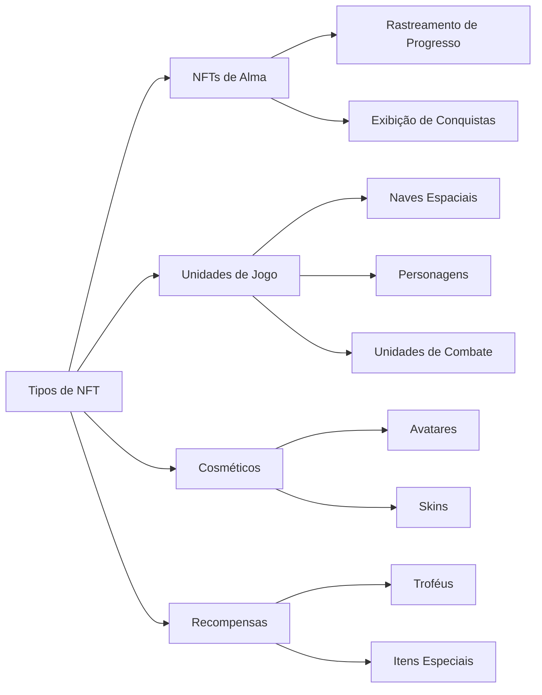
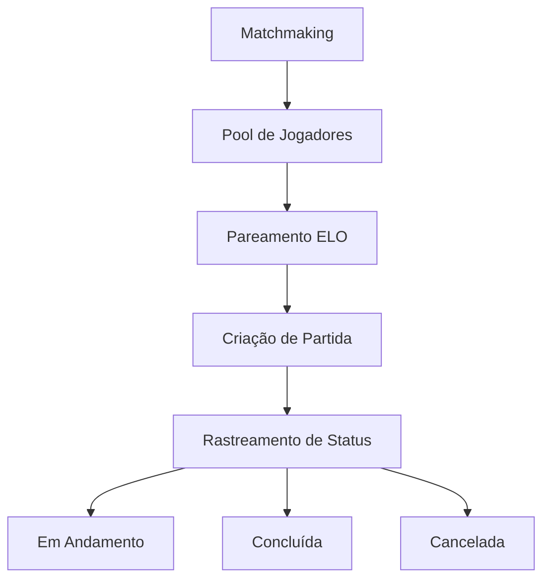

# Recursos Principais

## Visão Geral

Em seu núcleo, a **Cosmicrafts DAO** implementa um canister unificado que gerencia todas as funcionalidades principais do jogo através de vários sistemas integrados. Nossa arquitetura garante uma interação perfeita entre diferentes componentes, mantendo a segurança e transparência da tecnologia blockchain.

---

## Sistema de Jogadores

O Sistema de Jogadores forma a espinha dorsal da interação do usuário dentro do Cosmicrafts, gerenciando tudo, desde perfis básicos até interações sociais complexas.

### Gestão de Perfil

| Funcionalidade | Descrição | Benefício para o Jogador |
|----------------|-----------|-------------------------|
| Criação de Perfil | IDs únicos com nomes de usuário e avatares personalizáveis | Identidade pessoal no metaverso |
| Sistema de Níveis | Progressão baseada em experiência com recompensas | Caminho claro de progressão |
| Rastreamento de Estatísticas | Métricas abrangentes de desempenho | Insights de performance |
| Sistema de Títulos | Títulos desbloqueáveis mostrando conquistas | Reconhecimento de status |

### Recursos Sociais

Jogadores podem construir sua rede através de:
- Solicitações e gerenciamento de amizades
- Controle de configurações de privacidade
- Notificações em tempo real
- Gerenciamento de usuários bloqueados
- Rastreamento de atividade social

## Sistema de Ativos

Nosso sistema de ativos utiliza o padrão ICRC-7 para fornecer propriedade real e interoperabilidade.

### Categorias de NFTs

## Sistema Econômico

Nossa economia de dois tokens cria um ecossistema equilibrado para jogadores tanto gratuitos quanto premium.

### Estrutura de Tokens

| Token | Propósito | Aquisição | Uso |
|-------|-----------|-----------|-----|
| Spiral | Governança & Premium | Compra/Staking | Votação, Recursos Premium |
| Stardust | Moeda In-Game | Recompensas de Gameplay | Recursos Básicos, Crafting |

## Sistema de Matchmaking

Nosso sistema de matchmaking garante gameplay justo e envolvente através de pareamento sofisticado de jogadores.

### Recursos Principais

- Pareamento dinâmico baseado em habilidade
- Atualizações de status em tempo real
- Validação automática de partidas
- Ajustes de classificação baseados em desempenho

## Sistema de Missões e Conquistas

Um sistema abrangente de progressão que recompensa jogadores por suas realizações.

### Tipos de Missões

| Tipo | Frequência | Recompensas | Propósito |
|------|------------|-------------|-----------|
| Diária | 24 horas | Pequenas recompensas | Engajamento regular |
| Semanal | 7 dias | Recompensas médias | Atividade sustentada |
| Especial | Baseado em eventos | Recompensas únicas | Eventos comunitários |

### Categorias de Conquistas
- Maestria em Combate
- Conquista Econômica
- Engajamento Social
- Conclusão de Coleções
- Eventos Especiais

## Sistema de Registro

Nosso sistema transparente de registro rastreia todos os eventos e transações importantes.

### Atividades Rastreadas

| Categoria | Eventos Rastreados | Propósito |
|-----------|-------------------|-----------|
| Gameplay | Partidas, Estatísticas | Análise de Desempenho |
| Economia | Transações, Negociações | Monitoramento Econômico |
| Social | Interações, Amizades | Saúde da Comunidade |
| Progresso | Níveis, Conquistas | Desenvolvimento do Jogador |

## Segurança e Desempenho

### Medidas de Segurança
- Controles administrativos
- Protocolos de segurança de upgrade
- Validação de entrada
- Limitação de taxa
- Verificação de transações

### Otimizações
- Eficiência de canister único
- Recuperação rápida de dados
- Gerenciamento de memória
- Otimização de consultas

---

## Conclusão
Cosmicrafts representa um novo paradigma em jogos blockchain, mantendo os mais altos padrões de qualidade, segurança e desempenho.