# Архитектура

## Обзор

Cosmicrafts реализует гибридную архитектуру, которая стратегически интегрирует блокчейн и WebSocket для обеспечения:

- Безопасного владения и торговли активами
- Быстрого, отзывчивого геймплея
- Прозрачного управления
- Масштабируемой инфраструктуры

## Основной технический дизайн

::: info Техническая реализация
Язык программирования Motoko обеспечивает наш дизайн единого канистера через:
- Продвинутое управление памятью
- Эффективное представление состояния
- Мощную систему типов
- Оптимизированные асинхронные операции внутри одного канистера

Наши смарт-контракты [открыты на GitHub](https://github.com/cosmicrafts/cosmicrafts-dao) и [публично развернуты](https://dashboard.internetcomputer.org/canister/opcce-byaaa-aaaak-qcgda-cai) на Internet Computer для полной прозрачности.
:::

### Архитектура единого канистера

Cosmicrafts использует архитектуру единого канистера для основной игровой логики, NFT и операций с токенами, что обеспечивает значительные преимущества в производительности:

| Традиционный мульти-канистер | Единый канистер Cosmicrafts | Влияние на производительность |
|------------------------------|----------------------------|------------------------------|
| Межканистерные вызовы требуют раундов консенсуса | Внутренние вызовы функций в одном пространстве памяти | В 3-10 раз быстрее операции |
| Изменения состояния между канистерами требуют синхронизации | Атомарные обновления состояния в единой модели данных | Согласованные данные без необходимости сверки |
| Множественные сетевые обращения для сложных операций | Однократное выполнение для большинства игровых действий | Значительно сниженная задержка |
| Накладные расходы на сериализацию/десериализацию между канистерами | Прямой доступ к памяти для всех компонентов системы | Меньшие вычислительные накладные расходы |

Эта архитектура позволяет выполнять сложные игровые операции, такие как торговля, крафтинг и сражения, мгновенно, без задержек, обычно связанных с блокчейн-приложениями. Игроки получают производительность, сравнимую с традиционными игровыми платформами, при этом сохраняя преимущества безопасности и владения блокчейна.

```mermaid
graph TD
    %% Пользовательский слой
    User(("🧑 Пользователь"))
    
    %% Фронтенд слой
    subgraph "Слой фронтенда"
        UI["🖥️ Пользовательский интерфейс"]
        Client["📱 Игровой клиент"]
    end
    
    %% Коммуникационный слой
    subgraph " "
        WS["📡 WebSocket шлюз"]
        API["🔌 API интерфейс"]
    end
    
    %% Блокчейн слой
    subgraph "Слой блокчейна"
        Canister["⚡ Игровой канистер"]
        DAO["SNS управление"]
    end
    
    %% Соединения
    User --> UI
    User --> Client
    UI --> WS
    UI --> API
    Client --> WS
    Client --> API
    WS --> Canister
    API --> Canister
    Canister -.->|"Отчитывается"| DAO
    DAO -->|"Управляет"| Canister
    
    %% Стили
    classDef user fill:#1a2d40,stroke:#fff,stroke-width:2px
    classDef frontend fill:#0FB9FD20,stroke:#0FB9FD,stroke-width:2px
    classDef comms fill:#FFB80020,stroke:#FFB800,stroke-width:2px
    classDef blockchain fill:#00E5A420,stroke:#00E5A4,stroke-width:2px
    
    %% Применение стилей
    class User user
    class UI,Client frontend
    class WS,API comms
    class Canister,DAO blockchain
```

## Слой коммуникации в реальном времени

Критически важным компонентом нашей архитектуры является система коммуникации в реальном времени, необходимая для многопользовательского геймплея. Мы используем:

### IC WebSocket шлюз
- **[IC WebSocket Gateway](https://github.com/omnia-network/ic-websocket-gateway)**: Обеспечивает возможности WebSocket с криптографической безопасностью ICP
  - Обеспечивает двунаправленную коммуникацию в реальном времени
  - Поддерживает гарантии безопасности блокчейна
  - Поддерживает множественные одновременные соединения

### Функции безопасности
- **Подписание сообщений**: Все WebSocket сообщения криптографически подписаны
- **SSL/TLS шифрование**: Безопасный транспортный слой для всех коммуникаций
- **Мониторинг keep-alive**: Автоматические проверки здоровья соединения

| Функция | Реализация | Преимущество |
|---------|------------|--------------|
| Обновления в реальном времени | WebSocket протокол | Задержка менее секунды для игровых действий |
| Безопасность сообщений | Криптографическое подписание | Защищенная от подделки коммуникация |
| Управление соединениями | Автоматическое переподключение | Бесшовный игровой опыт |
| Синхронизация состояния | Порядковые номера | Согласованное состояние игры на всех клиентах |
| Безопасность передачи | SSL/TLS | Защищенная передача данных |

## Управление ресурсами и операции

### Среда без газа

Internet Computer устраняет сложность комиссий за газ в блокчейне, возвращаясь к простоте обычного использования интернета:

| Традиционный блокчейн | Internet Computer |
|-----------------------|-------------------|
| Пользователи платят газ за каждую транзакцию | Канистер оплачивает свои вычисления циклами |
| Сложная система комиссий создает трение и барьеры | Пользователи получают простоту Web2 без комиссий |

В отличие от других блокчейнов, где пользователи должны управлять комиссиями за газ, Internet Computer обрабатывает стоимость вычислений за кулисами. Это позволяет Cosmicrafts обеспечивать:

- **Доступность для массового пользователя**: Не требуются знания криптовалют для игры
- **Микротранзакции**: Даже малые внутриигровые действия остаются экономически жизнеспособными
- **Предсказуемый опыт**: Нет неожиданных затрат или неудачных транзакций из-за проблем с газом

### Мониторинг операций и управление циклами

Для поддержания нашей среды без газа и обеспечения оптимальной производительности Cosmicrafts использует ведущие отраслевые инструменты:

| Инструмент | Назначение | Реализация |
|------------|------------|-------------|
| [Cycleops](https://cycleops.dev) | - Управление циклами - Автоматические пополнения - Оповещения о пороговых значениях | Интегрирован с нашим процессом развертывания для проактивного управления циклами |
| [Canistergeek](https://github.com/usergeek/canistergeek-ic-motoko) | - Мониторинг производительности - Отслеживание использования памяти - Сбор логов | Встроен в наш Motoko код для аналитики канистера в реальном времени |

## Зависимости и внешние сервисы

### Зависимости игрового движка
- **Текущий: Unity**
  - Отраслевой стандарт платформы разработки игр
  - WebGL экспорт для браузерного геймплея
  - Возможности кросс-платформенного развертывания
  - Интеграция с ICP.NET для блокчейн-функций

- **Планируемая миграция: Bevy**
  - Открытый игровой движок на Rust
  - Лучшие характеристики производительности
  - Полностью открытый технологический стек
  - Нативная поддержка WebAssembly
  - Соответствует нашей приверженности открытой разработке

### Фронтенд зависимости
- **ICP интеграция**: 
  - [ICP.NET](https://github.com/edjCase/ICP.NET) - .NET/C#/Unity библиотека для нативной коммуникации с Internet Computer
  - Обеспечивает бесшовную интеграцию блокчейна в Unity игры
  - Предоставляет генерацию клиента для интерфейсов канистера
  - Обрабатывает WebSocket соединения и API интерфейсы

- **Веб-фреймворк**:
  - Vue.js с TypeScript
  - Vite для сборки
  - PWA возможности
  - Поддержка интернационализации через vue-i18n
  - Рендеринг Markdown с продвинутыми функциями

### Бэкенд зависимости
- **Менеджер пакетов Motoko**:
  - [MOPS](https://mops.one/) - Официальный менеджер пакетов для Motoko
  - Управляет зависимостями и версионированием Motoko

### Инфраструктурные сервисы
- **Internet Computer Protocol**:
  - Основная блокчейн инфраструктура
  - Предоставляет децентрализованные вычисления и хранение
  - Обрабатывает консенсус и операции узлов
  - Управляет жизненным циклом канистера

- **IC WebSocket Gateway**:
  - [Инфраструктура коммуникации в реальном времени](https://github.com/omnia-network/ic-websocket-gateway)
  - Обеспечивает многопользовательские игровые функции
  - Предоставляет безопасные WebSocket соединения
  - Интегрируется с моделью безопасности ICP

## Статус проверки безопасности

Хотя комплексный аудит безопасности планируется на будущее, в настоящее время мы:

- Наращиваем пользовательскую базу и совершенствуем функциональность канистера
- Планируем профессиональный аудит после достижения достаточного масштаба
- Следуем лучшим практикам безопасности и процессам внутреннего обзора

> Для полного понимания того, как реализованы эти функции, продолжите чтение нашей документации по [Основным функциям](/core-features).