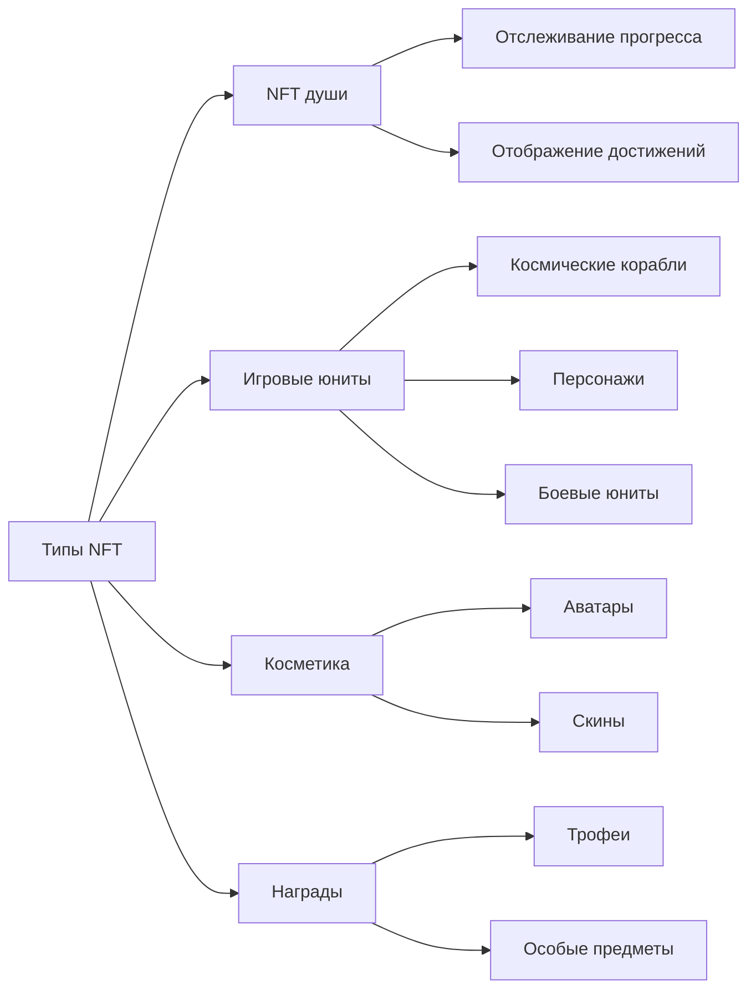
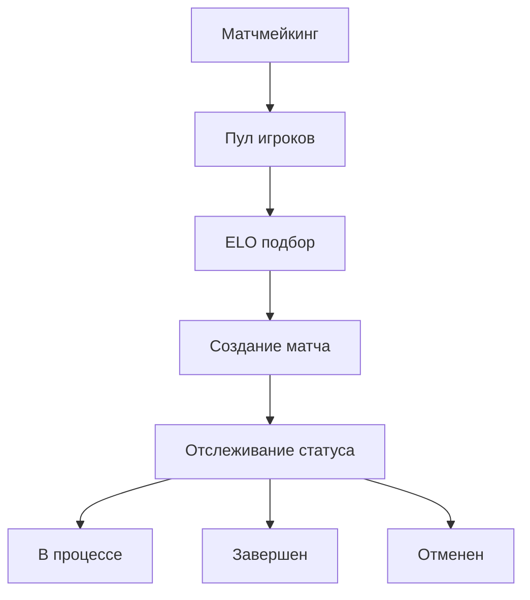

# Основные функции

## Обзор

В своей основе **Cosmicrafts DAO** реализует единый канистер, который управляет всеми основными функциями игры через несколько интегрированных систем. Наша архитектура обеспечивает бесшовное взаимодействие между различными компонентами, сохраняя при этом безопасность и прозрачность технологии блокчейн.

---

## Система игроков

Система игроков формирует основу взаимодействия пользователей в Cosmicrafts, управляя всем от базовых профилей до сложных социальных взаимодействий.

### Управление профилем

| Функция | Описание | Преимущество для игрока |
|---------|----------|------------------------|
| Создание профиля | Уникальные ID с настраиваемыми именами пользователей и аватарами | Личная идентичность в метавселенной |
| Система уровней | Прогрессия на основе опыта с наградами | Четкий путь развития |
| Отслеживание статистики | Комплексные метрики производительности | Анализ эффективности |
| Система титулов | Разблокируемые титулы, показывающие достижения | Признание статуса |

### Социальные функции

Игроки могут строить свою сеть через:
- Запросы и управление друзьями
- Контроль настроек приватности
- Уведомления в реальном времени
- Управление заблокированными пользователями
- Отслеживание социальной активности

## Система активов

Наша система активов использует стандарт ICRC-7 для обеспечения реального владения и интероперабельности.

### Категории NFT

## Экономическая система

Наша двухтокенная экономика создает сбалансированную экосистему как для бесплатных, так и для премиум игроков.

### Структура токенов

| Токен | Назначение | Получение | Использование |
|-------|------------|-----------|---------------|
| Spiral | Управление & Премиум | Покупка/Стейкинг | Голосование, Премиум функции |
| Stardust | Внутриигровая валюта | Награды за игру | Базовые функции, Крафтинг |

## Система матчмейкинга

Наша система матчмейкинга обеспечивает справедливый и увлекательный геймплей через сложный подбор игроков.

### Основные функции

- Динамический подбор на основе навыков
- Обновления статуса в реальном времени
- Автоматическая валидация матчей
- Корректировки рейтинга на основе производительности

## Система миссий и достижений

Комплексная система прогрессии, которая вознаграждает игроков за их достижения.

### Типы миссий

| Тип | Частота | Награды | Назначение |
|-----|---------|---------|------------|
| Ежедневные | 24 часа | Малые награды | Регулярное участие |
| Еженедельные | 7 дней | Средние награды | Устойчивая активность |
| Особые | На основе событий | Уникальные награды | События сообщества |

### Категории достижений
- Мастерство боя
- Экономические достижения
- Социальное взаимодействие
- Завершение коллекций
- Особые события

## Система логирования

Наша прозрачная система логирования отслеживает все важные события и транзакции.

### Отслеживаемые активности

| Категория | Отслеживаемые события | Назначение |
|-----------|----------------------|------------|
| Геймплей | Матчи, Статистика | Анализ производительности |
| Экономика | Транзакции, Торги | Мониторинг экономики |
| Социальное | Взаимодействия, Друзья | Здоровье сообщества |
| Прогресс | Уровни, Достижения | Развитие игрока |

## Безопасность и производительность

### Меры безопасности
- Административный контроль
- Протоколы безопасности обновлений
- Валидация ввода
- Ограничение частоты
- Верификация транзакций

### Оптимизации
- Эффективность единого канистера
- Быстрое извлечение данных
- Управление памятью
- Оптимизация запросов

---

## Заключение
Cosmicrafts представляет новую парадигму в блокчейн-играх, поддерживая высочайшие стандарты качества, безопасности и производительности.