# Mimari

## Genel Bakış

Cosmicrafts, şunları sağlamak için blokzincir ve WebSocket'leri stratejik olarak entegre eden hibrit bir mimari uygular:

- Güvenli varlık sahipliği ve ticaret
- Hızlı, duyarlı oyun deneyimi
- Şeffaf yönetişim
- Ölçeklenebilir altyapı

## Temel Teknik Tasarım

::: info Teknik Uygulama
Motoko programlama dili, tek canister tasarımımızı şunlar aracılığıyla mümkün kılar:
- Gelişmiş bellek yönetimi
- Verimli durum temsili
- Güçlü tip sistemi
- Tek canister içinde optimize edilmiş asenkron işlemler

Akıllı sözleşmelerimiz tam şeffaflık için [GitHub'da açık kaynak](https://github.com/cosmicrafts/cosmicrafts-dao) ve [Internet Computer üzerinde halka açık](https://dashboard.internetcomputer.org/canister/opcce-byaaa-aaaak-qcgda-cai) olarak yayınlanmıştır.
:::

### Birleşik Canister Mimarisi

Cosmicrafts, temel oyun mantığı, NFT'ler ve token işlemleri için tek bir canister mimarisi kullanır, önemli performans avantajları sağlar:

| Geleneksel Çoklu Canister | Cosmicrafts Tek Canister | Performans Etkisi |
|----------------------------|-----------------------------|--------------------|
| Canister'lar arası çağrılar konsensüs turları gerektirir | Aynı bellek alanında dahili fonksiyon çağrıları | 3-10x daha hızlı işlemler |
| Canister'lar arası durum değişiklikleri senkronizasyon gerektirir | Birleşik veri modelinde atomik durum güncellemeleri | Uzlaşma gerektirmeyen tutarlı veriler |
| Karmaşık işlemler için çoklu ağ turları | Çoğu oyun aktivitesi için tek sıçramalı yürütme | Önemli ölçüde azaltılmış gecikme |
| Canister'lar arası serileştirme/deserileştirme yükü | Tüm sistem bileşenlerine doğrudan bellek erişimi | Daha düşük hesaplama yükü |

Bu mimari, ticaret, üretim ve savaş gibi karmaşık oyun işlemlerinin, blokzincir uygulamalarıyla tipik olarak ilişkili gecikme olmadan anında yürütülmesini sağlar. Oyuncular, blokzincirin güvenlik ve sahiplik özelliklerinden yararlanırken geleneksel oyun platformlarına benzer performans deneyimler.

```mermaid
graph TD
    %% Core User Layer
    User(("🧑 Kullanıcı"))
    
    %% Frontend Layer
    subgraph "Frontend Katmanı"
        UI["🖥️ Kullanıcı Arayüzü"]
        Client["📱 Oyun İstemcisi"]
    end
    
    %% Communication Layer
    subgraph " "
        WS["📡 WebSocket Ağ Geçidi"]
        API["🔌 API Arayüzü"]
    end
    
    %% Blockchain Layer
    subgraph "Blokzincir Katmanı"
        Canister["⚡ Oyun Canister'ı"]
        DAO["SNS Yönetişimi"]
    end
    
    %% Connections
    User --> UI
    User --> Client
    UI --> WS
    UI --> API
    Client --> WS
    Client --> API
    WS --> Canister
    API --> Canister
    Canister -.->|"Raporlar"| DAO
    DAO -->|"Kontrol eder"| Canister
    
    %% Styles
    classDef user fill:#1a2d40,stroke:#fff,stroke-width:2px
    classDef frontend fill:#0FB9FD20,stroke:#0FB9FD,stroke-width:2px
    classDef comms fill:#FFB80020,stroke:#FFB800,stroke-width:2px
    classDef blockchain fill:#00E5A420,stroke:#00E5A4,stroke-width:2px
    
    %% Apply styles
    class User user
    class UI,Client frontend
    class WS,API comms
    class Canister,DAO blockchain
```

## Gerçek Zamanlı İletişim Katmanı

Mimarimizin kritik bir bileşeni, çok oyunculu oyun için gerekli olan gerçek zamanlı iletişim sistemidir. Şunları kullanıyoruz:

### IC WebSocket Ağ Geçidi
- **[IC WebSocket Ağ Geçidi](https://github.com/omnia-network/ic-websocket-gateway)**: ICP'nin kriptografik güvenliğiyle WebSocket yetenekleri sağlar
  - Gerçek zamanlı çift yönlü iletişimi etkinleştirir
  - Blokzincir güvenlik garantilerini korur
  - Çoklu eşzamanlı bağlantıları destekler

### Güvenlik Özellikleri
- **Mesaj İmzalama**: Tüm WebSocket mesajları kriptografik olarak imzalanır
- **SSL/TLS Şifreleme**: Tüm iletişimler için güvenli taşıma katmanı
- **Bağlantı Sağlığı İzleme**: Otomatik bağlantı sağlığı kontrolleri

| Özellik | Uygulama | Fayda |
|---------|----------------|----------|
| Gerçek Zamanlı Güncellemeler | WebSocket Protokolü | Oyun aksiyonları için saniye altı gecikme |
| Mesaj Güvenliği | Kriptografik İmzalama | Kurcalamaya dayanıklı iletişim |
| Bağlantı Yönetimi | Otomatik Yeniden Bağlanma | Kesintisiz oyun deneyimi |
| Durum Senkronizasyonu | Sıra Numaraları | İstemciler arası tutarlı oyun durumu |
| Taşıma Güvenliği | SSL/TLS | Korumalı veri iletimi |

## Kaynak Yönetimi ve İşlemler

### Gaz Ücretsiz Ortam

Internet Computer, blokzincir gaz ücretlerinin karmaşıklığını ortadan kaldırarak normal internet kullanımının basitliğine döner:

| Geleneksel Blokzincir | Internet Computer |
|-----------------------|-------------------|
| Kullanıcılar her işlem için gaz ücreti öder | Canister kendi hesaplama maliyetini döngülerle öder |
| Karmaşık ücret sistemi sürtünme ve engeller yaratır | Kullanıcılar ücret olmadan Web2 benzeri basitlik deneyimler |

Kullanıcıların gaz ücretlerini yönetmesi gereken diğer blokzincirlerin aksine, Internet Computer hesaplama maliyetlerini arka planda yönetir. Bu, Cosmicrafts'in şunları sunmasını sağlar:

- **Ana Akım Erişilebilirlik**: Oynamak için kripto para bilgisi gerekmez
- **Mikro İşlemler**: Küçük oyun içi işlemler bile ekonomik olarak uygulanabilir kalır
- **Öngörülebilir Deneyim**: Gaz sorunları nedeniyle sürpriz maliyetler veya başarısız işlemler yok

### Operasyonel İzleme ve Döngü Yönetimi

Gaz ücretsiz ortamımızı korumak ve optimal performansı sağlamak için Cosmicrafts sektör lideri araçlar kullanır:

| Araç | Amaç | Uygulama |
|------|---------|----------------|
| [Cycleops](https://cycleops.dev) | - Döngü yönetimi - Otomatik yükleme - Eşik uyarıları | Proaktif döngü yönetimi için dağıtım hattımızla entegre |
| [Canistergeek](https://github.com/usergeek/canistergeek-ic-motoko) | - Performans izleme - Bellek kullanımı takibi - Günlük toplama | Gerçek zamanlı canister analitiği için Motoko kod tabanımıza gömülü |

## Bağımlılıklar ve Dış Hizmetler

### Oyun Motoru Bağımlılıkları
- **Mevcut: Unity**
  - Endüstri standardı oyun geliştirme platformu
  - Tarayıcı tabanlı oyun için WebGL dışa aktarımı
  - Çapraz platform dağıtım yetenekleri
  - Blokzincir özellikleri için ICP.NET entegrasyonu

- **Planlanan Geçiş: Bevy**
  - Rust ile yazılmış açık kaynak oyun motoru
  - Daha iyi performans özellikleri
  - Tam açık kaynak teknoloji yığını
  - Yerel WebAssembly desteği
  - Açık kaynak geliştirme taahhüdümüzle uyumlu

### Frontend Bağımlılıkları
- **ICP Entegrasyonu**: 
  - [ICP.NET](https://github.com/edjCase/ICP.NET) - Yerel Internet Computer iletişimi için .NET/C#/Unity kütüphanesi
  - Unity oyunlarında sorunsuz blokzincir entegrasyonu sağlar
  - Canister arayüzleri için istemci oluşturma sağlar
  - WebSocket bağlantıları ve API arayüzlerini yönetir

- **Web Çerçevesi**:
  - TypeScript ile Vue.js
  - Derleme araçları için Vite
  - PWA yetenekleri
  - vue-i18n ile uluslararasılaştırma desteği
  - Gelişmiş özelliklerle Markdown işleme

### Backend Bağımlılıkları
- **Motoko Paket Yöneticisi**:
  - [MOPS](https://mops.one/) - Motoko için resmi paket yöneticisi
  - Motoko bağımlılıklarını ve sürümlerini yönetir

### Altyapı Hizmetleri
- **Internet Computer Protokolü**:
  - Temel blokzincir altyapısı
  - Merkezi olmayan hesaplama ve depolama sağlar
  - Konsensüs ve düğüm işlemlerini yönetir
  - Canister yaşam döngüsünü yönetir

- **IC WebSocket Ağ Geçidi**:
  - [Gerçek zamanlı iletişim altyapısı](https://github.com/omnia-network/ic-websocket-gateway)
  - Çok oyunculu oyun özelliklerini etkinleştirir
  - Güvenli WebSocket bağlantıları sağlar
  - ICP'nin güvenlik modeliyle entegre olur

## Güvenlik İnceleme Durumu

Gelecekte kapsamlı bir güvenlik denetimi planlanırken, şu anda:

- Kullanıcı tabanı oluşturuyor ve canister işlevselliğini olgunlaştırıyoruz
- Yeterli ölçeğe ulaşıldığında profesyonel denetim planlıyoruz
- Güvenlik en iyi uygulamalarını ve dahili inceleme süreçlerini takip ediyoruz

> Bu özelliklerin nasıl uygulandığına dair kapsamlı bir anlayış için [Temel Özellikler](/core-features) dokümantasyonumuzu okumaya devam edin.
