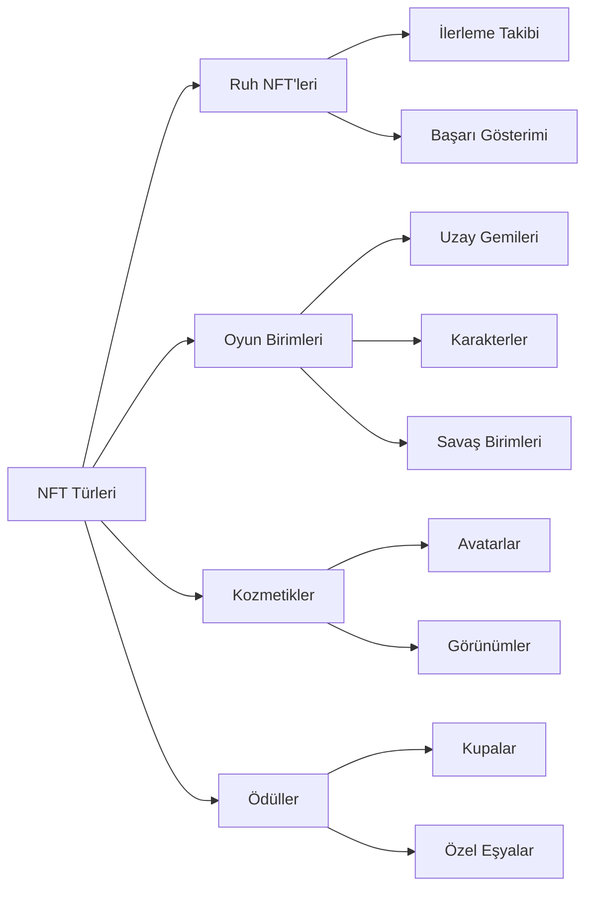
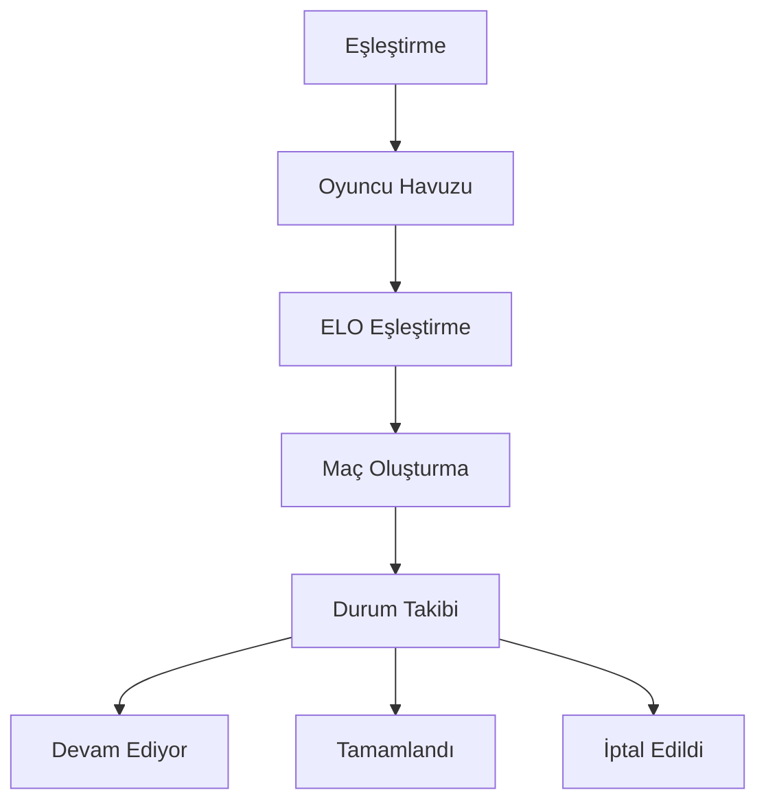

# Temel Özellikler

## Genel Bakış

Özünde, **Cosmicrafts DAO** tüm temel oyun işlevlerini çeşitli entegre sistemler aracılığıyla yöneten birleşik bir canister uygular. Mimarimiz, blokzincir teknolojisinin güvenliğini ve şeffaflığını korurken farklı bileşenler arasında sorunsuz etkileşim sağlar.

---

## Oyuncu Sistemi

Oyuncu Sistemi, temel profillerden karmaşık sosyal etkileşimlere kadar her şeyi yöneterek Cosmicrafts içindeki kullanıcı etkileşiminin omurgasını oluşturur.

### Profil Yönetimi

| Özellik | Açıklama | Oyuncu Faydası |
|---------|-------------|----------------|
| Profil Oluşturma | Özelleştirilebilir kullanıcı adları ve avatarlar ile benzersiz kimlikler | Metaverse'de kişisel kimlik |
| Seviye Sistemi | Ödüllü deneyim tabanlı ilerleme | Net ilerleme yolu |
| İstatistik Takibi | Kapsamlı performans metrikleri | Performans içgörüleri |
| Unvan Sistemi | Başarıları gösteren açılabilir unvanlar | Statü tanınırlığı |

### Sosyal Özellikler

Oyuncular ağlarını şunlar aracılığıyla oluşturabilir:
- Arkadaşlık istekleri ve yönetimi
- Gizlilik ayarları kontrolü
- Gerçek zamanlı bildirimler
- Engellenen kullanıcı yönetimi
- Sosyal aktivite takibi

## Varlık Sistemi

Varlık sistemimiz, gerçek sahiplik ve birlikte çalışabilirlik sağlamak için ICRC-7 standardından yararlanır.

### NFT Kategorileri

## Ekonomi Sistemi

Çift token ekonomimiz, hem ücretsiz hem de premium oyuncular için dengeli bir ekosistem oluşturur.

### Token Yapısı

| Token | Amaç | Edinme | Kullanım |
|-------|---------|-------------|--------|
| Spiral | Yönetişim & Premium | Satın Alma/Stake | Oylama, Premium Özellikler |
| Stardust | Oyun İçi Para Birimi | Oyun Ödülleri | Temel Özellikler, Üretim |

## Eşleştirme Sistemi

Eşleştirme sistemimiz, gelişmiş oyuncu eşleştirme yoluyla adil ve ilgi çekici oyun deneyimi sağlar.

### Temel Özellikler

- Dinamik beceri tabanlı eşleştirme
- Gerçek zamanlı durum güncellemeleri
- Otomatik maç doğrulama
- Performans tabanlı derece ayarlamaları

## Görev ve Başarı Sistemi

Oyuncuları başarıları için ödüllendiren kapsamlı bir ilerleme sistemi.

### Görev Türleri

| Tür | Sıklık | Ödüller | Amaç |
|------|-----------|---------|----------|
| Günlük | 24 saat | Küçük ödüller | Düzenli katılım |
| Haftalık | 7 gün | Orta ödüller | Sürdürülebilir aktivite |
| Özel | Etkinlik bazlı | Benzersiz ödüller | Topluluk etkinlikleri |

### Başarı Kategorileri
- Savaş Ustalığı
- Ekonomik Başarı
- Sosyal Katılım
- Koleksiyon Tamamlama
- Özel Etkinlikler

## Kayıt Sistemi

Şeffaf kayıt sistemimiz tüm önemli olayları ve işlemleri takip eder.

### İzlenen Aktiviteler

| Kategori | İzlenen Olaylar | Amaç |
|----------|---------------|----------|
| Oynanış | Maçlar, İstatistikler | Performans Analizi |
| Ekonomi | İşlemler, Takaslar | Ekonomik İzleme |
| Sosyal | Etkileşimler, Arkadaşlar | Topluluk Sağlığı |
| İlerleme | Seviyeler, Başarılar | Oyuncu Gelişimi |

## Güvenlik ve Performans

### Güvenlik Önlemleri
- Yönetimsel kontroller
- Güncelleme güvenlik protokolleri
- Girdi doğrulama
- Hız sınırlama
- İşlem doğrulama

### Optimizasyonlar
- Tek canister verimliliği
- Hızlı veri erişimi
- Bellek yönetimi
- Sorgu optimizasyonu

---

## Sonuç
Cosmicrafts, en yüksek kalite, güvenlik ve performans standartlarını koruyarak blokzincir oyunlarında yeni bir paradigmayı temsil eder.