# Kiến Trúc

## Tổng Quan

Cosmicrafts triển khai kiến trúc lai kết hợp blockchain và WebSocket một cách chiến lược để cung cấp:

- Quyền sở hữu và giao dịch tài sản an toàn
- Trải nghiệm chơi game nhanh, phản hồi tức thì
- Quản trị minh bạch
- Cơ sở hạ tầng có khả năng mở rộng

## Thiết Kế Kỹ Thuật Cốt Lõi

::: info Triển Khai Kỹ Thuật
Ngôn ngữ lập trình Motoko cho phép thiết kế canister đơn của chúng tôi thông qua:
- Quản lý bộ nhớ nâng cao
- Biểu diễn trạng thái hiệu quả
- Hệ thống kiểu mạnh mẽ
- Tối ưu hóa các hoạt động bất đồng bộ trong một canister

Các hợp đồng thông minh của chúng tôi [mã nguồn mở trên GitHub](https://github.com/cosmicrafts/cosmicrafts-dao) và [triển khai công khai](https://dashboard.internetcomputer.org/canister/opcce-byaaa-aaaak-qcgda-cai) trên Internet Computer để đảm bảo tính minh bạch hoàn toàn.
:::

### Kiến Trúc Canister Thống Nhất

Cosmicrafts sử dụng kiến trúc canister đơn cho logic trò chơi cốt lõi, NFT và các hoạt động token, mang lại những lợi thế hiệu suất đáng kể:

| Đa Canister Truyền Thống | Canister Đơn Cosmicrafts | Tác Động Hiệu Suất |
|----------------------------|-----------------------------|--------------------|
| Gọi giữa các canister yêu cầu vòng đồng thuận | Gọi hàm nội bộ trong cùng không gian bộ nhớ | Hoạt động nhanh hơn 3-10 lần |
| Thay đổi trạng thái giữa các canister cần đồng bộ hóa | Cập nhật trạng thái nguyên tử trong mô hình dữ liệu thống nhất | Dữ liệu nhất quán không cần điều hòa |
| Nhiều lượt truyền mạng cho các hoạt động phức tạp | Thực thi một bước cho hầu hết hoạt động game | Giảm độ trễ đáng kể |
| Chi phí tuần tự hóa/giải tuần tự hóa giữa các canister | Truy cập bộ nhớ trực tiếp đến mọi thành phần hệ thống | Chi phí tính toán thấp hơn |

Kiến trúc này cho phép các hoạt động game phức tạp như giao dịch, chế tạo và chiến đấu được thực thi ngay lập tức mà không có độ trễ thường thấy trong các ứng dụng blockchain. Người chơi trải nghiệm hiệu suất tương tự như các nền tảng game truyền thống, trong khi vẫn được hưởng lợi từ các tính năng bảo mật và quyền sở hữu của blockchain.

```mermaid
graph TD
    %% Lớp Người Dùng Cốt Lõi
    User(("🧑 Người Dùng"))
    
    %% Lớp Frontend
    subgraph "Lớp Frontend"
        UI["🖥️ Giao Diện Người Dùng"]
        Client["📱 Game Client"]
    end
    
    %% Lớp Giao Tiếp
    subgraph " "
        WS["📡 Cổng WebSocket"]
        API["🔌 Giao Diện API"]
    end
    
    %% Lớp Blockchain
    subgraph "Lớp Blockchain"
        Canister["⚡ Game Canister"]
        DAO["Quản Trị SNS"]
    end
    
    %% Kết Nối
    User --> UI
    User --> Client
    UI --> WS
    UI --> API
    Client --> WS
    Client --> API
    WS --> Canister
    API --> Canister
    Canister -.->|"Báo cáo cho"| DAO
    DAO -->|"Kiểm soát"| Canister
    
    %% Kiểu Dáng
    classDef user fill:#1a2d40,stroke:#fff,stroke-width:2px
    classDef frontend fill:#0FB9FD20,stroke:#0FB9FD,stroke-width:2px
    classDef comms fill:#FFB80020,stroke:#FFB800,stroke-width:2px
    classDef blockchain fill:#00E5A420,stroke:#00E5A4,stroke-width:2px
    
    %% Áp dụng kiểu dáng
    class User user
    class UI,Client frontend
    class WS,API comms
    class Canister,DAO blockchain
```

## Lớp Giao Tiếp Thời Gian Thực

Một thành phần quan trọng trong kiến trúc của chúng tôi là hệ thống giao tiếp thời gian thực cần thiết cho gameplay nhiều người chơi. Chúng tôi sử dụng:

### Cổng WebSocket IC
- **[IC WebSocket Gateway](https://github.com/omnia-network/ic-websocket-gateway)**: Cung cấp khả năng WebSocket với bảo mật mật mã của ICP
  - Cho phép giao tiếp hai chiều thời gian thực
  - Duy trì đảm bảo bảo mật blockchain
  - Hỗ trợ nhiều kết nối đồng thời

### Tính Năng Bảo Mật
- **Ký Tin Nhắn**: Tất cả tin nhắn WebSocket được ký mật mã
- **Mã Hóa SSL/TLS**: Lớp truyền tải an toàn cho mọi giao tiếp
- **Giám Sát Keep-alive**: Kiểm tra sức khỏe kết nối tự động

| Tính Năng | Triển Khai | Lợi Ích |
|---------|----------------|----------|
| Cập Nhật Thời Gian Thực | Giao Thức WebSocket | Độ trễ dưới giây cho hành động game |
| Bảo Mật Tin Nhắn | Ký Mật Mã | Giao tiếp không thể giả mạo |
| Quản Lý Kết Nối | Kết Nối Lại Tự Động | Trải nghiệm gameplay liền mạch |
| Đồng Bộ Hóa Trạng Thái | Số Thứ Tự | Trạng thái game nhất quán giữa các client |
| Bảo Mật Truyền Tải | SSL/TLS | Truyền dữ liệu được bảo vệ |

## Quản Lý & Vận Hành Tài Nguyên

### Môi Trường Không Gas

Internet Computer loại bỏ sự phức tạp của phí gas blockchain, quay trở lại sự đơn giản của việc sử dụng internet thông thường:

| Blockchain Truyền Thống | Internet Computer |
|-----------------------|-------------------|
| Người dùng trả phí gas cho mọi giao dịch | Canister tự trả cho việc tính toán bằng cycles |
| Hệ thống phí phức tạp tạo ra ma sát và rào cản | Người dùng trải nghiệm đơn giản như Web2 không có phí |

Khác với các blockchain khác nơi người dùng phải quản lý phí gas, Internet Computer xử lý chi phí tính toán ở hậu trường. Điều này cho phép Cosmicrafts cung cấp:

- **Khả Năng Tiếp Cận Đại Chúng**: Không cần kiến thức cryptocurrency để chơi
- **Giao Dịch Nhỏ**: Ngay cả các hành động nhỏ trong game vẫn khả thi về mặt kinh tế
- **Trải Nghiệm Dự Đoán Được**: Không có chi phí bất ngờ hoặc giao dịch thất bại do vấn đề gas

### Giám Sát Vận Hành & Quản Lý Cycles

Để duy trì môi trường không gas và đảm bảo hiệu suất tối ưu, Cosmicrafts sử dụng các công cụ hàng đầu trong ngành:

| Công Cụ | Mục Đích | Triển Khai |
|------|---------|----------------|
| [Cycleops](https://cycleops.dev) | - Quản lý cycles - Nạp tiền tự động - Cảnh báo ngưỡng | Tích hợp với quy trình triển khai của chúng tôi để quản lý cycles chủ động |
| [Canistergeek](https://github.com/usergeek/canistergeek-ic-motoko) | - Giám sát hiệu suất - Theo dõi sử dụng bộ nhớ - Thu thập nhật ký | Nhúng trong mã Motoko của chúng tôi để phân tích canister thời gian thực |

## Phụ Thuộc & Dịch Vụ Bên Ngoài

### Phụ Thuộc Game Engine
- **Hiện Tại: Unity**
  - Nền tảng phát triển game tiêu chuẩn ngành
  - Xuất WebGL cho gameplay trên trình duyệt
  - Khả năng triển khai đa nền tảng
  - Tích hợp với ICP.NET cho tính năng blockchain

- **Kế Hoạch Chuyển Đổi: Bevy**
  - Game engine mã nguồn mở viết bằng Rust
  - Đặc tính hiệu suất tốt hơn
  - Stack công nghệ mã nguồn mở hoàn toàn
  - Hỗ trợ WebAssembly gốc
  - Phù hợp với cam kết phát triển mã nguồn mở của chúng tôi

### Phụ Thuộc Frontend
- **Tích Hợp ICP**: 
  - [ICP.NET](https://github.com/edjCase/ICP.NET) - Thư viện .NET/C#/Unity cho giao tiếp Internet Computer gốc
  - Cho phép tích hợp blockchain liền mạch trong game Unity
  - Cung cấp tạo client cho giao diện canister
  - Xử lý kết nối WebSocket và giao diện API

- **Framework Web**:
  - Vue.js với TypeScript
  - Vite cho công cụ build
  - Khả năng PWA
  - Hỗ trợ quốc tế hóa qua vue-i18n
  - Render markdown với tính năng nâng cao

### Phụ Thuộc Backend
- **Trình Quản Lý Gói Motoko**:
  - [MOPS](https://mops.one/) - Trình quản lý gói chính thức cho Motoko
  - Quản lý phụ thuộc và phiên bản Motoko

### Dịch Vụ Cơ Sở Hạ Tầng
- **Internet Computer Protocol**:
  - Cơ sở hạ tầng blockchain cốt lõi
  - Cung cấp tính toán và lưu trữ phi tập trung
  - Xử lý đồng thuận và hoạt động node
  - Quản lý vòng đời canister

- **IC WebSocket Gateway**:
  - [Cơ sở hạ tầng giao tiếp thời gian thực](https://github.com/omnia-network/ic-websocket-gateway)
  - Cho phép tính năng gameplay nhiều người chơi
  - Cung cấp kết nối WebSocket an toàn
  - Tích hợp với mô hình bảo mật của ICP

## Trạng Thái Đánh Giá Bảo Mật

Mặc dù một cuộc kiểm toán bảo mật toàn diện được lên kế hoạch cho tương lai, hiện tại chúng tôi đang:

- Xây dựng cơ sở người dùng và hoàn thiện chức năng canister
- Lên kế hoạch kiểm toán chuyên nghiệp khi đạt đủ quy mô
- Tuân thủ các thực hành bảo mật tốt nhất và quy trình đánh giá nội bộ

> Để hiểu toàn diện về cách các tính năng này được triển khai, tiếp tục đọc tài liệu [Tính Năng Cốt Lõi](/core-features) của chúng tôi.

