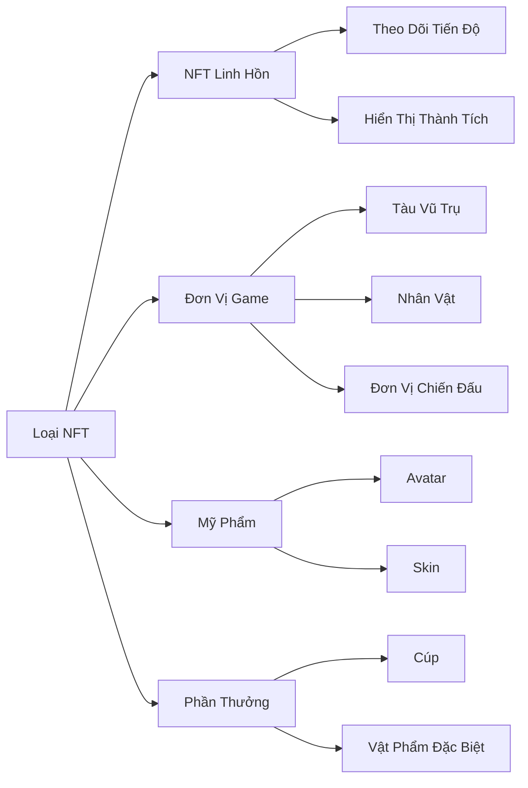
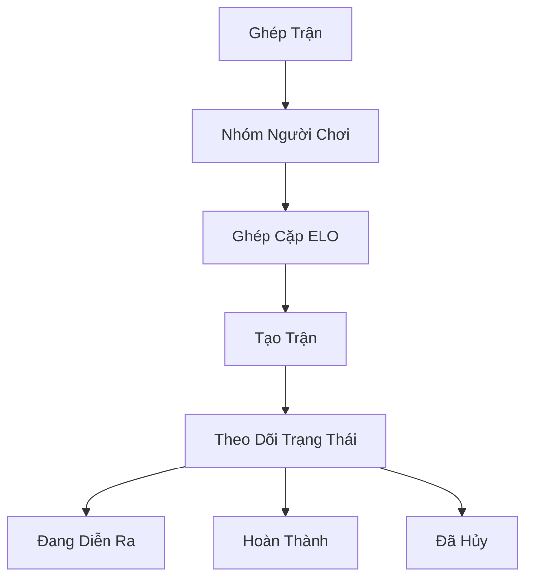

# Tính Năng Cốt Lõi

## Tổng Quan

Về cốt lõi, **Cosmicrafts DAO** triển khai một canister thống nhất xử lý tất cả chức năng game cốt lõi thông qua một số hệ thống tích hợp. Kiến trúc của chúng tôi đảm bảo tương tác liền mạch giữa các thành phần khác nhau trong khi vẫn duy trì tính bảo mật và minh bạch của công nghệ blockchain.

---

## Hệ Thống Người Chơi

Hệ thống Người Chơi tạo nên xương sống của tương tác người dùng trong Cosmicrafts, quản lý mọi thứ từ hồ sơ cơ bản đến tương tác xã hội phức tạp.

### Quản Lý Hồ Sơ

| Tính Năng | Mô Tả | Lợi Ích Người Chơi |
|---------|-------------|----------------|
| Tạo Hồ Sơ | ID duy nhất với tên người dùng và avatar tùy chỉnh | Danh tính cá nhân trong metaverse |
| Hệ Thống Cấp Độ | Tiến trình dựa trên kinh nghiệm với phần thưởng | Lộ trình tiến triển rõ ràng |
| Theo Dõi Chỉ Số | Số liệu hiệu suất toàn diện | Thông tin chi tiết về hiệu suất |
| Hệ Thống Danh Hiệu | Danh hiệu mở khóa thể hiện thành tích | Công nhận trạng thái |

### Tính Năng Xã Hội

Người chơi có thể xây dựng mạng lưới của họ thông qua:
- Yêu cầu và quản lý bạn bè
- Kiểm soát cài đặt quyền riêng tư
- Thông báo thời gian thực
- Quản lý người dùng bị chặn
- Theo dõi hoạt động xã hội

## Hệ Thống Tài Sản

Hệ thống tài sản của chúng tôi tận dụng tiêu chuẩn ICRC-7 để cung cấp quyền sở hữu thực và khả năng tương tác.

### Danh Mục NFT

## Hệ Thống Kinh Tế

Nền kinh tế hai token của chúng tôi tạo ra một hệ sinh thái cân bằng cho cả người chơi miễn phí và cao cấp.

### Cấu Trúc Token

| Token | Mục Đích | Cách Nhận | Sử Dụng |
|-------|---------|-------------|--------|
| Spiral | Quản Trị & Cao Cấp | Mua/Stake | Bỏ Phiếu, Tính Năng Cao Cấp |
| Stardust | Tiền Tệ Trong Game | Phần Thưởng Gameplay | Tính Năng Cơ Bản, Chế Tạo |

## Hệ Thống Ghép Trận

Hệ thống ghép trận của chúng tôi đảm bảo gameplay công bằng và hấp dẫn thông qua việc ghép cặp người chơi tinh vi.

### Tính Năng Chính

- Ghép cặp dựa trên kỹ năng động
- Cập nhật trạng thái thời gian thực
- Xác thực trận đấu tự động
- Điều chỉnh xếp hạng dựa trên hiệu suất

## Hệ Thống Nhiệm Vụ & Thành Tích

Hệ thống tiến triển toàn diện thưởng cho người chơi về thành tích của họ.

### Loại Nhiệm Vụ

| Loại | Tần Suất | Phần Thưởng | Mục Đích |
|------|-----------|---------|----------|
| Hàng Ngày | 24 giờ | Phần thưởng nhỏ | Tham gia thường xuyên |
| Hàng Tuần | 7 ngày | Phần thưởng trung bình | Hoạt động bền vững |
| Đặc Biệt | Theo sự kiện | Phần thưởng độc đáo | Sự kiện cộng đồng |

### Danh Mục Thành Tích
- Thành Thạo Chiến Đấu
- Thành Tích Kinh Tế
- Tương Tác Xã Hội
- Hoàn Thành Bộ Sưu Tập
- Sự Kiện Đặc Biệt

## Hệ Thống Ghi Nhật Ký

Hệ thống ghi nhật ký minh bạch của chúng tôi theo dõi tất cả sự kiện và giao dịch quan trọng.

### Hoạt Động Được Theo Dõi

| Danh Mục | Sự Kiện Theo Dõi | Mục Đích |
|----------|---------------|----------|
| Gameplay | Trận Đấu, Chỉ Số | Phân Tích Hiệu Suất |
| Kinh Tế | Giao Dịch, Trao Đổi | Giám Sát Kinh Tế |
| Xã Hội | Tương Tác, Bạn Bè | Sức Khỏe Cộng Đồng |
| Tiến Triển | Cấp Độ, Thành Tích | Phát Triển Người Chơi |

## Bảo Mật & Hiệu Suất

### Biện Pháp Bảo Mật
- Kiểm soát quản trị
- Giao thức an toàn nâng cấp
- Xác thực đầu vào
- Giới hạn tốc độ
- Xác minh giao dịch

### Tối Ưu Hóa
- Hiệu quả canister đơn
- Truy xuất dữ liệu nhanh
- Quản lý bộ nhớ
- Tối ưu hóa truy vấn

---

## Kết Luận
Cosmicrafts đại diện cho một mô hình mới trong game blockchain duy trì tiêu chuẩn cao nhất về chất lượng, bảo mật và hiệu suất.