# 架构

## 概述

Cosmicrafts实现了区块链和WebSocket的战略性集成混合架构，提供：

- 安全的资产所有权和交易
- 快速、响应式的游戏体验
- 透明的治理
- 可扩展的基础设施

## 核心技术设计

::: info 技术实现
Motoko编程语言通过以下特性实现单容器设计：
- 高级内存管理
- 高效状态表示
- 强大的类型系统
- 单容器内优化的异步操作

我们的智能合约为了完全透明，在[GitHub上开源](https://github.com/cosmicrafts/cosmicrafts-dao)并[公开部署](https://dashboard.internetcomputer.org/canister/opcce-byaaa-aaaak-qcgda-cai)在Internet Computer上。
:::

### 统一容器架构

Cosmicrafts利用单容器架构处理核心游戏逻辑、NFT和代币操作，提供显著的性能优势：

| 传统多容器 | Cosmicrafts单容器 | 性能影响 |
|----------------------------|-----------------------------|--------------------|
| 跨容器调用需要共识轮次 | 同一内存空间内的内部函数调用 | 3-10倍速度提升 |
| 容器间状态变更需要同步 | 统一数据模型中的原子状态更新 | 无需协调的一致数据 |
| 复杂操作需要多次网络往返 | 大多数游戏活动单跳执行 | 显著降低延迟 |
| 容器间序列化/反序列化开销 | 直接访问所有系统组件内存 | 更低的计算开销 |

该架构使交易、合成、战斗等复杂游戏操作能够即时执行，无需区块链应用程序通常的延迟。玩家在享受区块链安全性和所有权特性的同时，体验到与传统游戏平台相似的性能。

```mermaid
graph TD
    %% Core User Layer
    User(("🧑 用户"))
    
    %% Frontend Layer
    subgraph "前端层"
        UI["🖥️ 用户界面"]
        Client["📱 游戏客户端"]
    end
    
    %% Communication Layer
    subgraph " "
        WS["📡 WebSocket网关"]
        API["🔌 API接口"]
    end
    
    %% Blockchain Layer
    subgraph "区块链层"
        Canister["⚡ 游戏容器"]
        DAO["SNS治理"]
    end
    
    %% Connections
    User --> UI
    User --> Client
    UI --> WS
    UI --> API
    Client --> WS
    Client --> API
    WS --> Canister
    API --> Canister
    Canister -.->|"报告"| DAO
    DAO -->|"控制"| Canister
    
    %% Styles
    classDef user fill:#1a2d40,stroke:#fff,stroke-width:2px
    classDef frontend fill:#0FB9FD20,stroke:#0FB9FD,stroke-width:2px
    classDef comms fill:#FFB80020,stroke:#FFB800,stroke-width:2px
    classDef blockchain fill:#00E5A420,stroke:#00E5A4,stroke-width:2px
    
    %% Apply styles
    class User user
    class UI,Client frontend
    class WS,API comms
    class Canister,DAO blockchain
```

## 实时通信层

我们架构的关键组件是多人游戏所需的实时通信系统。我们利用：

### IC WebSocket网关
- **[IC WebSocket Gateway](https://github.com/omnia-network/ic-websocket-gateway)**: 提供带有ICP加密安全性的WebSocket功能
  - 实现实时双向通信
  - 维持区块链安全保证
  - 支持多个并发连接

### 安全特性
- **消息签名**: 所有WebSocket消息都经过加密签名
- **SSL/TLS加密**: 所有通信的安全传输层
- **保活监控**: 自动连接健康检查

| 功能 | 实现 | 优势 |
|---------|----------------|----------|
| 实时更新 | WebSocket协议 | 游戏动作延迟低于1秒 |
| 消息安全 | 加密签名 | 防篡改通信 |
| 连接管理 | 自动重连 | 无缝游戏体验 |
| 状态同步 | 序列号 | 客户端间一致的游戏状态 |
| 传输安全 | SSL/TLS | 受保护的数据传输 |

## 资源管理 & 运营

### 无Gas环境

Internet Computer消除了区块链Gas费的复杂性，回归普通互联网使用的简单性：

| 传统区块链 | Internet Computer |
|-----------------------|-------------------|
| 用户为每笔交易支付Gas费 | 容器使用cycles支付自身计算成本 |
| 复杂的费用系统造成摩擦和障碍 | 用户体验类似Web2的无费用简单性 |

与其他需要用户管理Gas费的区块链不同，Internet Computer在后台处理计算成本。这使得Cosmicrafts能够提供：

- **主流可访问性**: 无需加密货币知识即可游戏
- **微交易**: 小规模游戏内动作也经济可行
- **可预测体验**: 无Gas问题导致的意外成本或失败交易

### 运营监控 & Cycles管理

为维持无Gas环境和确保最佳性能，Cosmicrafts使用行业领先工具：

| 工具 | 目的 | 实现 |
|------|---------|----------------|
| [Cycleops](https://cycleops.dev) | - Cycles管理 - 自动充值 - 阈值警报 | 与部署管道集成实现主动Cycles管理 |
| [Canistergeek](https://github.com/usergeek/canistergeek-ic-motoko) | - 性能监控 - 内存使用追踪 - 日志收集 | 集成到Motoko代码库实现实时容器分析 |

## 依赖关系 & 外部服务

### 游戏引擎依赖
- **当前: Unity**
  - 行业标准游戏开发平台
  - 用于浏览器游戏的WebGL导出
  - 跨平台部署能力
  - 区块链功能的ICP.NET集成

- **计划迁移: Bevy**
  - 用Rust编写的开源游戏引擎
  - 更好的性能特性
  - 完全开源技术栈
  - 原生WebAssembly支持
  - 符合我们对开源开发的承诺

### 前端依赖
- **ICP集成**: 
  - [ICP.NET](https://github.com/edjCase/ICP.NET) - Internet Computer原生通信的.NET/C#/Unity库
  - 实现Unity游戏的无缝区块链集成
  - 提供容器接口的客户端生成
  - 处理WebSocket连接和API接口

- **Web框架**:
  - 使用TypeScript的Vue.js
  - Vite作为构建工具
  - PWA功能
  - 通过vue-i18n支持国际化
  - 具有高级功能的Markdown渲染

### 后端依赖
- **Motoko包管理器**:
  - [MOPS](https://mops.one/) - Motoko官方包管理器
  - 管理Motoko依赖和版本

### 基础设施服务
- **Internet Computer Protocol**:
  - 核心区块链基础设施
  - 提供分布式计算和存储
  - 处理共识和节点操作
  - 管理容器生命周期

- **IC WebSocket Gateway**:
  - [实时通信基础设施](https://github.com/omnia-network/ic-websocket-gateway)
  - 启用多人游戏功能
  - 提供安全WebSocket连接
  - 与ICP安全模型集成

## 安全审查状态

虽然计划在未来进行全面的安全审计，但目前我们：

- 正在构建用户基础并成熟容器功能
- 计划在达到足够规模时进行专业审计
- 遵循安全最佳实践和内部审查流程

> 要全面了解这些功能如何实现，请继续阅读[核心功能](/core-features)文档。

