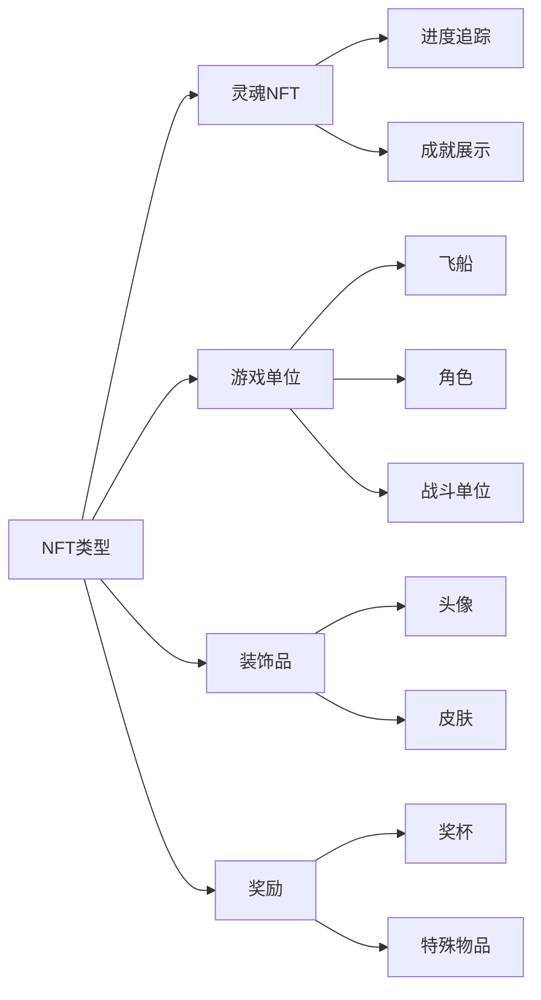
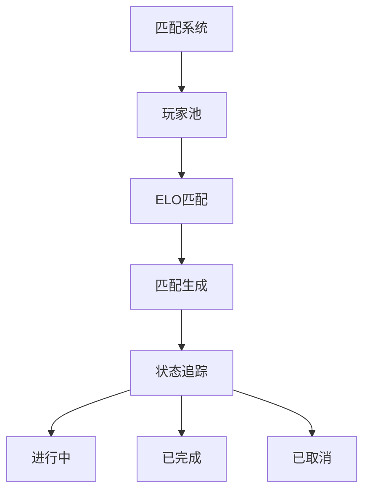

# 核心功能

## 概述

Cosmicrafts通过统一的容器管理所有核心游戏功能。我们的架构在保持区块链技术的安全性和透明度的同时，提供以下功能：

::: info 技术规格
本节提供游戏玩法和功能概述。有关各系统具体实现和技术细节，请参阅系统设计文档。
:::

## 玩家系统

玩家系统构成了Cosmicrafts中用户互动的核心，从基本档案到复杂的社交互动。

### 档案管理

| 功能 | 说明 | 玩家优势 |
|---------|-------------|----------------|
| 档案创建 | 具有可自定义用户名和头像的唯一ID | 元宇宙中的个人身份 |
| 等级系统 | 基于经验值的进度奖励 | 明确的进度路径 |
| 统计追踪 | 全面的表现指标 | 性能洞察 |
| 称号系统 | 可解锁的成就称号 | 地位认可 |

### 社交功能

玩家可以通过以下方式建立网络：
- 好友请求和管理
- 隐私设置控制
- 实时通知
- 封禁用户管理
- 社交活动追踪

## 资产系统

我们的资产系统利用ICRC-7标准提供真正的所有权和互操作性。

### NFT类别

## 经济系统

我们的双代币经济为免费玩家和高级玩家提供平衡的生态系统。

### 代币结构

| 代币 | 目的 | 获取方式 | 使用途径 |
|-------|---------|-------------|--------|
| Spiral | 治理 & 高级功能 | 购买/质押 | 投票、高级功能 |
| Stardust | 游戏内货币 | 游戏奖励 | 基础功能、合成 |

## 匹配系统

我们的匹配系统通过精密的玩家匹配确保公平和有吸引力的游戏体验。

### 主要功能

- 动态技能匹配
- 实时状态更新
- 自动匹配验证
- 基于表现的评级调整

## 任务 & 成就系统

全面的进度系统，奖励玩家的成就。

### 任务类型

| 类型 | 周期 | 奖励 | 目的 |
|------|-----------|---------|----------|
| 每日 | 24小时 | 小额奖励 | 定期参与 |
| 每周 | 7天 | 中额奖励 | 持续活动 |
| 特殊 | 基于事件 | 独特奖励 | 社区活动 |

### 成就类别
- 战斗熟练度
- 经济成就
- 社交参与
- 收藏完成
- 特殊事件

## 日志系统

我们的透明日志系统追踪所有重要事件和交易。

### 追踪活动

| 类别 | 追踪事件 | 目的 |
|----------|---------------|----------|
| 游戏玩法 | 对局、统计 | 性能分析 |
| 经济 | 交易、兑换 | 经济监控 |
| 社交 | 互动、好友 | 社区健康度 |
| 进度 | 等级、成就 | 玩家发展 |

## 安全性 & 性能

### 安全措施
- 管理员控制
- 升级安全协议
- 输入验证
- 速率限制
- 交易验证

### 优化
- 单容器效率
- 快速数据检索
- 内存管理
- 查询优化

---

## 结论
Cosmicrafts代表着区块链游戏的新范式，保持着质量、安全性和性能的最高标准。